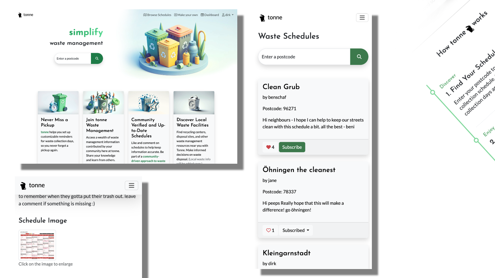

# 🌍 Eco-Conscious Waste Management App: Your Partner in Green Living! 🌿
[Experience our live website here!](https://tonne-waste-reminders-a6836f2888b0.herokuapp.com/)

[](https://github.com/benschaf/waste-schedule/commits/main)
[](https://github.com/benschaf/waste-schedule/commits/main)
[](https://github.com/benschaf/waste-schedule)
[](https://github.com/benschaf/waste-schedule/issues)

Welcome to the Waste Management App, your go-to solution in the quest for efficient and eco-friendly waste handling! 🚀



⤴️ preview of the site on different devices

Our app is not just about managing waste, it's about creating a sustainable future, one notification at a time. Here's what we offer:

1. 📅 **Waste Collection Reminders:**
    - Say goodbye to forgotten collection days! Our intuitive dashboard allows you to search for your postcode and receive real-time reminders in your calendar. Whether it's the Grüne Tonne or Gelbe Tonne, our timely notifications ensure that you will never have to rush out your bins again in the last second.

2. 👥 **Community Interaction:**
    - Be part of the green revolution! Users can upload and rate waste collection schedules, ensuring the highest level of accuracy and reliability.
    - Everyone can Customize existing schedules and actively contribute to your communities.

Join us in building a community-driven resource that's making a real difference. Together, we can create a cleaner, greener world - one bin at a time! 🌳

## UX

### Colour Scheme
I used a very subtle green and white colour scheme to reflect the eco-friendly nature of the app. Coolors was used to generate the [colour palette](https://coolors.co/25a55f-2a2a2a-1c7b47-e6e6e6-57d992).


Screenshot of the colour palette from Coolors

- `--pigment-green: #25a55f` - used for primary buttons and highlights
- `--emerald: #57d992` - used for secondary buttons and highlights
- `--dark-spring-green: #1c7b47` - used for darker highlights
- `--jet: #2a2a2a` - used for bright backgrounds
- `--platinum: #e6e6e6` - used for light buttons

In order to have easier access to my colour scheme within my code i used CSS `:root` variables. These also include transparent versions of the colours for backgrounds.

```css
:root {
    --primary-color: #25a55f;
    --secondary-color: #57d992;
    --darker-secondary-color: #1c7b47;
    --primary-transparent-background: #25a55f45;
    --secondary-transparent-background: #1c7b47db;
    --dark-background: #2a2a2a;
    --light-background: #e6e6e6;
}
```


```css
:root {
    /* P = Primary | S = Secondary */
    --p-text: #000000;
    --p-highlight: #E84610;
    --s-text: #4A4A4F;
    --s-highlight: #009FE3;
    --white: #FFFFFF;
    --black: #000000;
}
```

### Typography

- [Josefin Sans](https://fonts.google.com/specimen/Josefin+Sans) was used for all titles and subheadings. It's a modern, elegant font that stands out, complementing the otherwise minimalistic colour scheme and design.

- [Lato](https://fonts.google.com/specimen/Lato) was used for body and all other text. It's a clean, easy-to-read font that ensures a smooth user experience.

- [Font Awesome](https://fontawesome.com) icons were used throughout the site, such as the social media icons in the footer.

## Wireframes
To follow best practice, wireframes were developed for mobile, tablet, and desktop sizes.
I've used [draw.io](https://balsamiq.com/wireframes) to design my site wireframes.

View the [original draw.io file](https://drive.google.com/file/d/1KmW3ppV6V6eGe11EsY1J0-Z69dtKagAU/view?usp=sharing) of the wireframes. (click on the "Open with" button and select "draw.io")

| Page | Mobile Wireframe | Tablet Wireframe | Desktop Wireframe |
| --- | --- | --- | --- |
| Landing Page |  |  |  |
| Schedule List |  |  |  |
| Schedule Detail and Editor |  |  |  |
| Dashboard |  |  |  |
| Schedule Builder |  |  |  |

## User Stories

🛑🛑🛑🛑🛑🛑🛑🛑🛑🛑 START OF NOTES (to be deleted)

In this section, list all of your user stories for the project.

🛑🛑🛑🛑🛑🛑🛑🛑🛑🛑-END OF NOTES (to be deleted)
View the [user story map](https://github.com/users/benschaf/projects/9/views/2) created for this project using Github Projects


### New Site Users

- As a new site user, I would like to ____________, so that I can ____________.
- As a new site user, I would like to ____________, so that I can ____________.
- As a new site user, I would like to ____________, so that I can ____________.
- As a new site user, I would like to ____________, so that I can ____________.
- As a new site user, I would like to ____________, so that I can ____________.

### Returning Site Users

- As a returning site user, I would like to ____________, so that I can ____________.
- As a returning site user, I would like to ____________, so that I can ____________.
- As a returning site user, I would like to ____________, so that I can ____________.
- As a returning site user, I would like to ____________, so that I can ____________.
- As a returning site user, I would like to ____________, so that I can ____________.

### Site Admin

- As a site administrator, I should be able to ____________, so that I can ____________.
- As a site administrator, I should be able to ____________, so that I can ____________.
- As a site administrator, I should be able to ____________, so that I can ____________.
- As a site administrator, I should be able to ____________, so that I can ____________.
- As a site administrator, I should be able to ____________, so that I can ____________.


### Flowchart
Somewhere include a flowchart that maps out the user journey through the site.

## Features

🛑🛑🛑🛑🛑🛑🛑🛑🛑🛑 START OF NOTES (to be deleted)

In this section, you should go over the different parts of your project,
and describe each in a sentence or so.

You will need to explain what value each of the features provides for the user,
focusing on who this website is for, what it is that they want to achieve,
and how your project is the best way to help them achieve these things.

For some/all of your features, you may choose to reference the specific project files that implement them.

IMPORTANT: Remember to always include a screenshot of each individual feature!

🛑🛑🛑🛑🛑🛑🛑🛑🛑🛑-END OF NOTES (to be deleted)

### Existing Features

- **YOUR-TITLE-FOR-FEATURE-#1**

    - Details about this particular feature, including the value to the site, and benefit for the user. Be as detailed as possible!


- **YOUR-TITLE-FOR-FEATURE-#2**

    - Details about this particular feature, including the value to the site, and benefit for the user. Be as detailed as possible!


- **YOUR-TITLE-FOR-FEATURE-#3**

    - Details about this particular feature, including the value to the site, and benefit for the user. Be as detailed as possible!


🛑🛑🛑🛑🛑🛑🛑🛑🛑🛑 START OF NOTES (to be deleted)

Repeat as necessary for as many features as your site contains.

Hint: the more, the merrier!

🛑🛑🛑🛑🛑🛑🛑🛑🛑🛑-END OF NOTES (to be deleted)

### Future Features

🛑🛑🛑🛑🛑🛑🛑🛑🛑🛑 START OF NOTES (to be deleted)

Do you have additional ideas that you'd like to include on your project in the future?
Fantastic! List them here!
It's always great to have plans for future improvements!
Consider adding any helpful links or notes to help remind you in the future, if you revisit the project in a couple years.

🛑🛑🛑🛑🛑🛑🛑🛑🛑🛑-END OF NOTES (to be deleted)

- YOUR-TITLE-FOR-FUTURE-FEATURE-#1
    - Any additional notes about this feature.
- YOUR-TITLE-FOR-FUTURE-FEATURE-#2
    - Any additional notes about this feature.
- YOUR-TITLE-FOR-FUTURE-FEATURE-#3
    - Any additional notes about this feature.

## Tools & Technologies Used

🛑🛑🛑🛑🛑🛑🛑🛑🛑🛑 START OF NOTES (to be deleted)

In this section, you should explain the various tools and technologies used to develop the project.
Make sure to put a link (where applicable) to the source, and explain what each was used for.
Some examples have been provided, but this is just a sample only, your project might've used others.
Feel free to delete any unused items below as necessary.

🛑🛑🛑🛑🛑🛑🛑🛑🛑🛑-END OF NOTES (to be deleted)

- ⚠️⚠️ REQUIRED <-- delete me ⚠️⚠️
- [](https://tim.2bn.dev/markdown-builder) used to generate README and TESTING templates.
- [](https://git-scm.com) used for version control. (`git add`, `git commit`, `git push`)
- [](https://github.com) used for secure online code storage.
- ⚠️⚠️ CHOOSE ONLY ONE <-- delete me ⚠️⚠️
- [](https://gitpod.io) used as a cloud-based IDE for development.
- [](https://codeanywhere.com) used as a cloud-based IDE for development.
- [](https://code.visualstudio.com) used as my local IDE for development.
- ⚠️⚠️ CHOOSE ALL APPLICABLE <-- delete me ⚠️⚠️
- [](https://en.wikipedia.org/wiki/HTML) used for the main site content.
- [](https://en.wikipedia.org/wiki/CSS) used for the main site design and layout.
- [](https://www.javascript.com) used for user interaction on the site.
- [](https://jquery.com) used for user interaction on the site.
- [](https://www.python.org) used as the back-end programming language.
- ⚠️⚠️ CHOOSE ONLY ONE <-- delete me ⚠️⚠️
- [](https://pages.github.com) used for hosting the deployed front-end site.
- [](https://www.heroku.com) used for hosting the deployed back-end site.
- ⚠️⚠️ CHOOSE ONLY ONE (if applicable) <-- delete me ⚠️⚠️
- [](https://getbootstrap.com) used as the front-end CSS framework for modern responsiveness and pre-built components.
- [](https://materializecss.com) used as the front-end CSS framework for modern responsiveness and pre-built components.
- ⚠️⚠️ CHOOSE ALL APPLICABLE <-- delete me ⚠️⚠️
- [](https://docs.google.com/spreadsheets) used for storing data from my Python app.
- [](https://jestjs.io) used for automated JavaScript testing.
- [](https://flask.palletsprojects.com) used as the Python framework for the site.
- [](https://www.mongodb.com) used as the non-relational database management with Flask.
- [](https://www.sqlalchemy.org) used as the relational database management with Flask.
- [](https://www.djangoproject.com) used as the Python framework for the site.
- [](https://www.postgresql.org) used as the relational database management.
- [](https://dbs.ci-dbs.net) used as the Postgres database from Code Institute.
- [](https://www.elephantsql.com) used as the Postgres database.
- [](https://cloudinary.com) used for online static file storage.
- [](https://whitenoise.readthedocs.io) used for serving static files with Heroku.
- [](https://stripe.com) used for online secure payments of ecommerce products/services.
- [](https://mail.google.com) used for sending emails in my application.
- [](https://mailchimp.com) used for sending newsletter subscriptions.
- [](https://aws.amazon.com/s3) used for online static file storage.
- [](https://balsamiq.com/wireframes) used for creating wireframes.
- [](https://www.canva.com/p/canvawireframes) used for creating wireframes.
- [](https://developers.google.com/maps) used as an interactive map on my site.
- [](https://leafletjs.com) used as a free open-source interactive map on my site.
- [](https://fontawesome.com) used for the icons.
- [](https://chat.openai.com) used to help debug, troubleshoot, and explain things.

## Database Design

Entity Relationship Diagrams (ERD) help to visualize database architecture before creating models.
Understanding the relationships between different tables can save time later in the project.

🛑🛑🛑🛑🛑🛑🛑🛑🛑🛑 START OF NOTES (to be deleted)

Using your defined models (one example below), create an ERD with the relationships identified.

🛑🛑🛑🛑🛑🛑🛑🛑🛑🛑-END OF NOTES (to be deleted)

```python
class Product(models.Model):
    category = models.ForeignKey(
        "Category", null=True, blank=True, on_delete=models.SET_NULL)
    sku = models.CharField(max_length=254, null=True, blank=True)
    name = models.CharField(max_length=254)
    description = models.TextField()
    has_sizes = models.BooleanField(default=False, null=True, blank=True)
    price = models.DecimalField(max_digits=6, decimal_places=2)
    rating = models.DecimalField(
        max_digits=6, decimal_places=2, null=True, blank=True)
    image_url = models.URLField(max_length=1024, null=True, blank=True)
    image = models.ImageField(null=True, blank=True)

    def __str__(self):
        return self.name
```

Link to the [ERD](https://dbdiagram.io/e/66178e7003593b6b61bbb163/6618fa1203593b6b61d512e4)

🛑🛑🛑🛑🛑🛑🛑🛑🛑🛑 START OF NOTES (to be deleted)

A couple recommendations for building free ERDs:
- [Draw.io](https://draw.io)
- [Lucidchart](https://www.lucidchart.com/pages/ER-diagram-symbols-and-meaning)

A more comprehensive ERD can be auto-generated once you're
at the end of your development stages, just before you submit.
Follow the steps below to obtain a thorough ERD that you can include.
Feel free to leave the steps in the README for future use to yourself.

🛑🛑🛑🛑🛑🛑🛑🛑🛑🛑-END OF NOTES (to be deleted)

I have used `pygraphviz` and `django-extensions` to auto-generate an ERD.

The steps taken were as follows:
- In the terminal: `sudo apt update`
- then: `sudo apt-get install python3-dev graphviz libgraphviz-dev pkg-config`
- then type `Y` to proceed
- then: `pip3 install django-extensions pygraphviz`
- in my `settings.py` file, I added the following to my `INSTALLED_APPS`:
```python
INSTALLED_APPS = [
    ...
    'django_extensions',
    ...
]
```
- back in the terminal: `python3 manage.py graph_models -a -o erd.png`
- dragged the new `erd.png` file into my `documentation/` folder
- removed `'django_extensions',` from my `INSTALLED_APPS`
- finally, in the terminal: `pip3 uninstall django-extensions pygraphviz -y`


source: [medium.com](https://medium.com/@yathomasi1/1-using-django-extensions-to-visualize-the-database-diagram-in-django-application-c5fa7e710e16)


## Agile Development Process

### GitHub Projects

[GitHub Projects](https://github.com/benschaf/waste-schedule/projects) served as an Agile tool for this project.
It isn't a specialized tool, but with the right tags and project creation/issue assignments, it can be made to work.

Through it, user stories, issues, and milestone tasks were planned, then tracked on a weekly basis using the basic Kanban board.

🛑🛑🛑🛑🛑🛑🛑🛑🛑🛑 START OF NOTES (to be deleted)

Consider adding a basic screenshot of your Projects Board.

🛑🛑🛑🛑🛑🛑🛑🛑🛑🛑-END OF NOTES (to be deleted)


### GitHub Issues

[GitHub Issues](https://github.com/benschaf/waste-schedule/issues) served as an another Agile tool.
There, I used my own **User Story Template** to manage user stories.

It also helped with milestone iterations on a weekly basis.

🛑🛑🛑🛑🛑🛑🛑🛑🛑🛑 START OF NOTES (to be deleted)

Consider adding a screenshot of your Open and Closed Issues.

🛑🛑🛑🛑🛑🛑🛑🛑🛑🛑-END OF NOTES (to be deleted)

- [Open Issues](https://github.com/benschaf/waste-schedule/issues) [](https://github.com/benschaf/waste-schedule/issues)

    

- [Closed Issues](https://github.com/benschaf/waste-schedule/issues?q=is%3Aissue+is%3Aclosed) [](https://github.com/benschaf/waste-schedule/issues?q=is%3Aissue+is%3Aclosed)

    

### MoSCoW Prioritization

I've decomposed my Epics into stories prior to prioritizing and implementing them.
Using this approach, I was able to apply the MoSCow prioritization and labels to my user stories within the Issues tab.

- **Must Have**: guaranteed to be delivered (*max 60% of stories*)
- **Should Have**: adds significant value, but not vital (*the rest ~20% of stories*)
- **Could Have**: has small impact if left out (*20% of stories*)
- **Won't Have**: not a priority for this iteration

## Testing

> [!NOTE]
> For all testing, please refer to the [TESTING.md](TESTING.md) file.

## Deployment

🛑🛑🛑🛑🛑🛑🛑🛑🛑🛑-START OF NOTES (to be deleted)

**IMPORTANT:**

- ⚠️ DO NOT update the environment variables to your own! These should NOT be included in this file; just demo values! ⚠️
- ⚠️ DO NOT update the environment variables to your own! These should NOT be included in this file; just demo values! ⚠️
- ⚠️ DO NOT update the environment variables to your own! These should NOT be included in this file; just demo values! ⚠️

🛑🛑🛑🛑🛑🛑🛑🛑🛑🛑-END OF NOTES (to be deleted)

The live deployed application can be found deployed on [Heroku](https://fdfsaf1beedfcc0.herokuapp.com).

### PostgreSQL Database

This project uses a [Code Institute PostgreSQL Database](https://dbs.ci-dbs.net).

To obtain my own Postgres Database from Code Institute, I followed these steps:

- Signed-in to the CI LMS using my email address.
- An email was sent to me with my new Postgres Database.

> [!CAUTION]
> - PostgreSQL databases by Code Institute are only available to CI Students.
> - You must acquire your own PostgreSQL database through some other method
> if you plan to clone/fork this repository.
> - Code Institute students are allowed a maximum of 8 databases.
> - Databases are subject to deletion after 18 months.

### Cloudinary API

This project uses the [Cloudinary API](https://cloudinary.com) to store media assets online, due to the fact that Heroku doesn't persist this type of data.

To obtain your own Cloudinary API key, create an account and log in.

- For *Primary interest*, you can choose *Programmable Media for image and video API*.
- Optional: *edit your assigned cloud name to something more memorable*.
- On your Cloudinary Dashboard, you can copy your **API Environment Variable**.
- Be sure to remove the `CLOUDINARY_URL=` as part of the API **value**; this is the **key**.

### Heroku Deployment

This project uses [Heroku](https://www.heroku.com), a platform as a service (PaaS) that enables developers to build, run, and operate applications entirely in the cloud.

Deployment steps are as follows, after account setup:

- Select **New** in the top-right corner of your Heroku Dashboard, and select **Create new app** from the dropdown menu.
- Your app name must be unique, and then choose a region closest to you (EU or USA), and finally, select **Create App**.
- From the new app **Settings**, click **Reveal Config Vars**, and set your environment variables.

> [!IMPORTANT]
> This is a sample only; you would replace the values with your own if cloning/forking my repository.

| Key | Value |
| --- | --- |
| `CLOUDINARY_URL` | user's own value |
| `DATABASE_URL` | user's own value |
| `DISABLE_COLLECTSTATIC` | 1 (*this is temporary, and can be removed for the final deployment*) |
| `SECRET_KEY` | user's own value |

Heroku needs three additional files in order to deploy properly.

- requirements.txt
- Procfile
- runtime.txt

You can install this project's **requirements** (where applicable) using:

- `pip3 install -r requirements.txt`

If you have your own packages that have been installed, then the requirements file needs updated using:

- `pip3 freeze --local > requirements.txt`

The **Procfile** can be created with the following command:

- `echo web: gunicorn app_name.wsgi > Procfile`
- *replace **app_name** with the name of your primary Django app name; the folder where settings.py is located*

The **runtime.txt** file needs to know which Python version you're using:
1. type: `python3 --version` in the terminal.
2. in the **runtime.txt** file, add your Python version:
	- `python-3.9.18`

For Heroku deployment, follow these steps to connect your own GitHub repository to the newly created app:

Either:

- Select **Automatic Deployment** from the Heroku app.

Or:

- In the Terminal/CLI, connect to Heroku using this command: `heroku login -i`
- Set the remote for Heroku: `heroku git:remote -a app_name` (replace *app_name* with your app name)
- After performing the standard Git `add`, `commit`, and `push` to GitHub, you can now type:
	- `git push heroku main`

The project should now be connected and deployed to Heroku!

### Local Deployment

This project can be cloned or forked in order to make a local copy on your own system.

For either method, you will need to install any applicable packages found within the *requirements.txt* file.

- `pip3 install -r requirements.txt`.

You will need to create a new file called `env.py` at the root-level,
and include the same environment variables listed above from the Heroku deployment steps.

> [!IMPORTANT]
> This is a sample only; you would replace the values with your own if cloning/forking my repository.

Sample `env.py` file:

```python
import os

os.environ.setdefault("CLOUDINARY_URL", "user's own value")
os.environ.setdefault("DATABASE_URL", "user's own value")
os.environ.setdefault("SECRET_KEY", "user's own value")

# local environment only (do not include these in production/deployment!)
os.environ.setdefault("DEBUG", "True")
```

Once the project is cloned or forked, in order to run it locally, you'll need to follow these steps:

- Start the Django app: `python3 manage.py runserver`
- Stop the app once it's loaded: `CTRL+C` or `⌘+C` (Mac)
- Make any necessary migrations: `python3 manage.py makemigrations`
- Migrate the data to the database: `python3 manage.py migrate`
- Create a superuser: `python3 manage.py createsuperuser`
- Load fixtures (if applicable): `python3 manage.py loaddata file-name.json` (repeat for each file)
- Everything should be ready now, so run the Django app again: `python3 manage.py runserver`

#### Cloning

You can clone the repository by following these steps:

1. Go to the [GitHub repository](https://github.com/benschaf/waste-schedule)
2. Locate the Code button above the list of files and click it
3. Select if you prefer to clone using HTTPS, SSH, or GitHub CLI and click the copy button to copy the URL to your clipboard
4. Open Git Bash or Terminal
5. Change the current working directory to the one where you want the cloned directory
6. In your IDE Terminal, type the following command to clone my repository:
	- `git clone https://github.com/benschaf/waste-schedule.git`
7. Press Enter to create your local clone.

Alternatively, if using Gitpod, you can click below to create your own workspace using this repository.

[](https://gitpod.io/#https://github.com/benschaf/waste-schedule)

Please note that in order to directly open the project in Gitpod, you need to have the browser extension installed.
A tutorial on how to do that can be found [here](https://www.gitpod.io/docs/configure/user-settings/browser-extension).

#### Forking

By forking the GitHub Repository, we make a copy of the original repository on our GitHub account to view and/or make changes without affecting the original owner's repository.
You can fork this repository by using the following steps:

1. Log in to GitHub and locate the [GitHub Repository](https://github.com/benschaf/waste-schedule)
2. At the top of the Repository (not top of page) just above the "Settings" Button on the menu, locate the "Fork" Button.
3. Once clicked, you should now have a copy of the original repository in your own GitHub account!

### Local VS Deployment

🛑🛑🛑🛑🛑🛑🛑🛑🛑🛑-START OF NOTES (to be deleted)

Use this space to discuss any differences between the local version you've developed, and the live deployment site on Heroku.

🛑🛑🛑🛑🛑🛑🛑🛑🛑🛑-END OF NOTES (to be deleted)

## Credits

🛑🛑🛑🛑🛑🛑🛑🛑🛑🛑-START OF NOTES (to be deleted)

In this section you need to reference where you got your content, media, and extra help from.
It is common practice to use code from other repositories and tutorials,
however, it is important to be very specific about these sources to avoid plagiarism.

🛑🛑🛑🛑🛑🛑🛑🛑🛑🛑-END OF NOTES (to be deleted)

### Content

🛑🛑🛑🛑🛑🛑🛑🛑🛑🛑-START OF NOTES (to be deleted)

Use this space to provide attribution links to any borrowed code snippets, elements, or resources.
A few examples have been provided below to give you some ideas.

Ideally, you should provide an actual link to every resource used, not just a generic link to the main site!

⚠️⚠️ EXAMPLE LINKS - REPLACE WITH YOUR OWN ⚠️⚠️

🛑🛑🛑🛑🛑🛑🛑🛑🛑🛑-END OF NOTES (to be deleted)

| Source | Location | Notes |
| --- | --- | --- |
| [Markdown Builder](https://tim.2bn.dev/markdown-builder) | README and TESTING | tool to help generate the Markdown files |
| [Chris Beams](https://chris.beams.io/posts/git-commit) | version control | "How to Write a Git Commit Message" |
| [W3Schools](https://www.w3schools.com/howto/howto_js_topnav_responsive.asp) | entire site | responsive HTML/CSS/JS navbar |
| [W3Schools](https://www.w3schools.com/howto/howto_css_modals.asp) | contact page | interactive pop-up (modal) |
| [W3Schools](https://www.w3schools.com/css/css3_variables.asp) | entire site | how to use CSS :root variables |
| [Flexbox Froggy](https://flexboxfroggy.com/) | entire site | modern responsive layouts |
| [Grid Garden](https://cssgridgarden.com) | entire site | modern responsive layouts |
| [StackOverflow](https://stackoverflow.com/a/2450976) | quiz page | Fisher-Yates/Knuth shuffle in JS |
| [YouTube](https://www.youtube.com/watch?v=YL1F4dCUlLc) | leaderboard | using `localStorage()` in JS for high scores |
| [YouTube](https://www.youtube.com/watch?v=u51Zjlnui4Y) | PP3 terminal | tutorial for adding color to the Python terminal |
| [strftime](https://strftime.org) | CRUD functionality | helpful tool to format date/time from string |
| [WhiteNoise](http://whitenoise.evans.io) | entire site | hosting static files on Heroku temporarily |

### Media

🛑🛑🛑🛑🛑🛑🛑🛑🛑🛑-START OF NOTES (to be deleted)

Use this space to provide attribution links to any images, videos, or audio files borrowed from online.
A few examples have been provided below to give you some ideas.

If you're the owner (or a close acquaintance) of all media files, then make sure to specify this.
Let the assessors know that you have explicit rights to use the media files within your project.

Ideally, you should provide an actual link to every media file used, not just a generic link to the main site!
The list below is by no means exhaustive. Within the Code Institute Slack community, you can find more "free media" links
by sending yourself the following command: `!freemedia`.

⚠️⚠️ EXAMPLE LINKS - REPLACE WITH YOUR OWN ⚠️⚠️

🛑🛑🛑🛑🛑🛑🛑🛑🛑🛑-END OF NOTES (to be deleted)

| Source | Location | Type | Notes |
| --- | --- | --- | --- |
| [Pexels](https://www.pexels.com) | entire site | image | favicon on all pages |
| [Lorem Picsum](https://picsum.photos) | home page | image | hero image background |
| [Unsplash](https://unsplash.com) | product page | image | sample of fake products |
| [Pixabay](https://pixabay.com) | gallery page | image | group of photos for gallery |
| [Wallhere](https://wallhere.com) | footer | image | background wallpaper image in the footer |
| [This Person Does Not Exist](https://thispersondoesnotexist.com) | testimonials | image | headshots of fake testimonial images |
| [Audio Micro](https://www.audiomicro.com/free-sound-effects) | game page | audio | free audio files to generate the game sounds |
| [Videvo](https://www.videvo.net/) | home page | video | background video on the hero section |
| [TinyPNG](https://tinypng.com) | entire site | image | tool for image compression |

### Acknowledgements

🛑🛑🛑🛑🛑🛑🛑🛑🛑🛑-START OF NOTES (to be deleted)

Use this space to provide attribution to any supports that helped, encouraged, or supported you throughout the development stages of this project.
A few examples have been provided below to give you some ideas.

⚠️⚠️ EXAMPLES ONLY - REPLACE WITH YOUR OWN ⚠️⚠️

🛑🛑🛑🛑🛑🛑🛑🛑🛑🛑-END OF NOTES (to be deleted)

- I would like to thank my Code Institute mentor, [Tim Nelson](https://github.com/TravelTimN) for his support throughout the development of this project.
- I would like to thank the [Code Institute](https://codeinstitute.net) tutor team for their assistance with troubleshooting and debugging some project issues.
- I would like to thank the [Code Institute Slack community](https://code-institute-room.slack.com) for the moral support; it kept me going during periods of self doubt and imposter syndrome.
- I would like to thank my partner (John/Jane), for believing in me, and allowing me to make this transition into software development.
- I would like to thank my employer, for supporting me in my career development change towards becoming a software developer.

## Design Thinking Process
### Emphatise
For this stage, I created 4 user personas to represent the different types of users that would interact with the app.

For each persona, I considered their "5 Cs" (circumstances, constraints, context, criteria, and compensating behaviors) related to waste management and waste management reminders. This helped me understand their needs and motivations better.

1. **Eco-Conscious Emma**:
    Emma is a young environmental enthusiast living in a bustling city like Berlin. She actively separates her waste into different bins, composts organic materials, and participates in local recycling programs. Emma is passionate about reducing her ecological footprint and encourages her neighbors to do the same. She would appreciate an app that provides real-time reminders for waste collection days, educates users about proper waste sorting, and offers tips on sustainable living.
    - **Circumstances**:
        - Emma faces the problem when she’s juggling work, social commitments, and her passion for environmental sustainability.
    - **Constraints**:
        - Her busy lifestyle often leads to forgetfulness about waste collection days.
        - Lack of clear information on local recycling centers and drop-off points.
    - **Context**:
        - Emma encounters this issue at home, especially during early mornings when she needs to take out her bins.
    - **Criteria**:
        - Solving this problem aligns with Emma’s values of reducing waste and contributing to a greener planet.
    - **Compensating Behaviors**:
        - Emma sets manual reminders on her phone but occasionally misses them due to her hectic schedule.

2. **Busy Bernd**:
    Bernd is a working professional in Munich. His busy schedule often leads to forgetfulness, and he occasionally misses waste collection days. He needs an app that sends notifications a day in advance, reminding him to take out his bins. Bernd also wants information on nearby recycling centers and drop-off points for hazardous waste. A feature that tracks his waste reduction progress would motivate him to be more diligent.
    - **Circumstances**:
        - Bernd’s demanding job and family responsibilities make it challenging for him to remember waste collection days.
    - **Constraints**:
        - Time constraints prevent him from researching local waste management rules thoroughly.
    - **Context**:
        - Bernd faces this issue at home, especially during evenings when he’s exhausted from work.
    - **Criteria**:
        - Solving this problem would reduce stress and prevent missed collections.
    - **Compensating Behaviors**:
        - Bernd relies on neighbors’ cues or waits until he hears the garbage truck to take out his bins.

3. **Senior Sigrid**:
    Sigrid, a retiree in Hamburg, values simplicity. She finds the current waste management system confusing and struggles with the various colored bins. Sigrid needs an app with clear instructions on waste separation, including visual cues. Additionally, a feature that connects her with local volunteers or services for assistance with heavy bins would be helpful.
    - **Circumstances**:
        - Sigrid’s age affects her memory, and she finds the waste separation process confusing.
    - **Constraints**:
        - Physical limitations prevent her from handling heavy bins easily.
    - **Context**:
        - Sigrid encounters this issue at home, especially when she needs to sort waste into different containers.
    - **Criteria**:
        - Solving this problem ensures Sigrid’s independence and reduces frustration.
    - **Compensating Behaviors**:
        - Sigrid asks her neighbor for help or leaves her bins outside for extended periods.

4. **Family-Focused Felix**:
    Felix lives in a suburban area near Frankfurt with his family. Managing waste for a household of four can be overwhelming. He wants an app that syncs with family members’ calendars, reminding everyone about collection days. Felix also seeks advice on minimizing waste, especially with kids in the house. Perhaps the app could gamify waste reduction to involve the whole family.
    - **Circumstances**:
        - Felix manages waste for his family, balancing work, parenting, and household chores.
    - **Constraints**:
        - Coordinating waste collection days among family members is challenging.
    - **Context**:
        - Felix faces this issue both at home and during family discussions.
    - **Criteria**:
        - Solving this problem streamlines family routines and teaches kids responsible waste management.
    - **Compensating Behaviors**:
        - Felix uses sticky notes or a shared calendar to remind everyone about bin days.

### Define
Considering all the user personas, I defined problem statements for each of them:

#### Problem statements:
1. **Eco-Conscious Emma**:
    - **Statement**: “I am Eco-Conscious Emma trying to reduce waste, but the lack of timely reminders due to my busy schedule makes me feel frustrated and guilty.”
    - **Statement**: “I am Eco-Conscious Emma trying to educate my neighbors about waste sorting, but the unclear rules due to insufficient information make me feel determined yet overwhelmed.”
2. **Busy Bernd**:
    - **Statement**: “I am Busy Bernd trying to remember waste collection days, but my forgetfulness due to a hectic work schedule makes me feel stressed and annoyed.”
    - **Statement**: “I am Busy Bernd trying to find local recycling centers, but the lack of time due to work commitments makes me feel overwhelmed and uninformed.”
3. **Senior Sigrid**:
    - **Statement**: “I am Senior Sigrid trying to sort waste, but the confusion due to age-related memory challenges makes me feel frustrated and helpless.”
    - **Statement**: “I am Senior Sigrid trying to handle heavy bins, but my physical limitations due to aging make me feel dependent and anxious.”
4. **Family-Focused Felix**:
    - **Statement**: “I am Family-Focused Felix trying to coordinate family waste routines, but the complexity due to managing a household makes me feel overwhelmed yet responsible.”
    - **Statement**: “I am Family-Focused Felix trying to involve kids in waste reduction, but the lack of guidance due to parenting challenges makes me feel determined and hopeful.”

[!IMPORTANT]
Overwork the problem statement

**Overarching Problem Statement**: In a world grappling with stress and environmental challenges, our project aims to develop an integrated waste management solution that addresses the diverse needs of individuals — ranging from busy professionals and eco-conscious citizens to seniors and families. By providing a platform for community engagement, we strive to minimize the stress and confusion that accompany waste management, fostering a sense of responsibility and empowerment among communities. Our mission is to empower everyone, regardless of age or lifestyle, to actively participate in waste reduction, ultimately fostering a cleaner and greener planet.

### Ideate
Considering the problem statements, I brainstormed potential solutions that could address the needs of each user persona. Here are some ideas already with an added priority value (p1: high priority, p2: medium priority, p3: low priority):

1. **Eco-Conscious Emma**:
    - **Solution 1: Waste Collection Reminders**:
        - **p1** Implement a calendar view that highlights upcoming collection days and allows Emma to set preferences (e.g., reminders a day in advance).
        - **p1** Create a community platform within the app where users like Emma can voluntarily share their waste collection schedules.
        - **p1** Neighbors receive real-time reminders based on shared schedules, fostering a sense of community responsibility.
    - **Solution 2: Educational Resources**:
        - **p2** Include an educational section within the app. Provide clear guidelines on waste sorting, recycling, and composting. Use visual cues (infographics, images) to simplify the information.
        - **p3** Collaborate with local environmental organizations to curate content and host webinars on sustainable living.

2. **Busy Bernd**:
    - **Solution 1: Automated Notifications**:
        - **p1** Upon login, prompt Bernd to input his address and preferred notification settings. Send automated reminders via email or SMS a day before waste collection days.
        - **p1** Allow customization (e.g., specific time of day for reminders) to accommodate Bernd’s schedule.
    - **Solution 2: Nearby Services Locator**:
        - **p3** Integrate a map feature that displays nearby recycling centers, drop-off points, and hazardous waste disposal locations.
        - **p3** Include operating hours, contact information, and directions.

3. **Senior Sigrid**:
    - **Solution 1: Visual Guides**:
        - **p3** Develop an intuitive waste sorting guide with visual icons. Sigrid can easily identify which bin to use based on item categories (e.g., paper, plastic, glass).
        - **p3** Include voice instructions for accessibility.
    - **Solution 2: Assistance Network**:
        - **p3** Create a community feature where neighbors can offer assistance. Sigrid can request help with heavy bins or ask for clarification on waste separation.
        - **p2** Encourage local volunteers to participate.

4. **Family-Focused Felix**:
    - **Solution 1: Family Calendar Integration**:
        - **p2** Allow Felix to invite family members to join the app. Sync the app with their calendars to display waste collection days.
        - **p2** Enable notifications for all family members, ensuring everyone is aware.
    - **Solution 2: Waste Reduction Challenges**:
        - **p3** Gamify waste reduction within the family. Set monthly challenges (e.g., reduce plastic waste, compost more) and track progress.
        - **p3** Award virtual badges or points for achieving goals.

### Prototype
After ideating I created wireframes and content for the prototype of the site which is of course this repository.

Check out the full prototype including wireframes, user stories, and the working site by browsing around the readme and the repository. Also check out the [tonne website](https://tonne-waste-reminders-a6836f2888b0.herokuapp.com/) itself.

### Test
The prototype of the site was tested manually and progamatically to ensure that it is working as intended.
Testing in the sense of design thinking has not been very extensive yet. This will be done in the future.