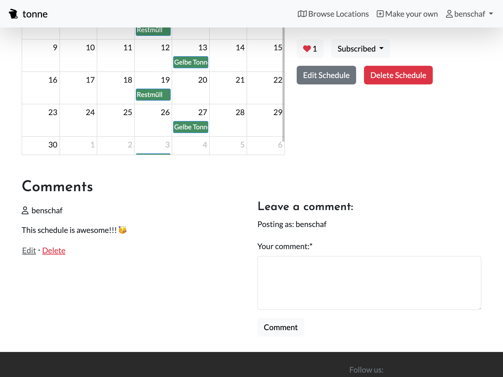
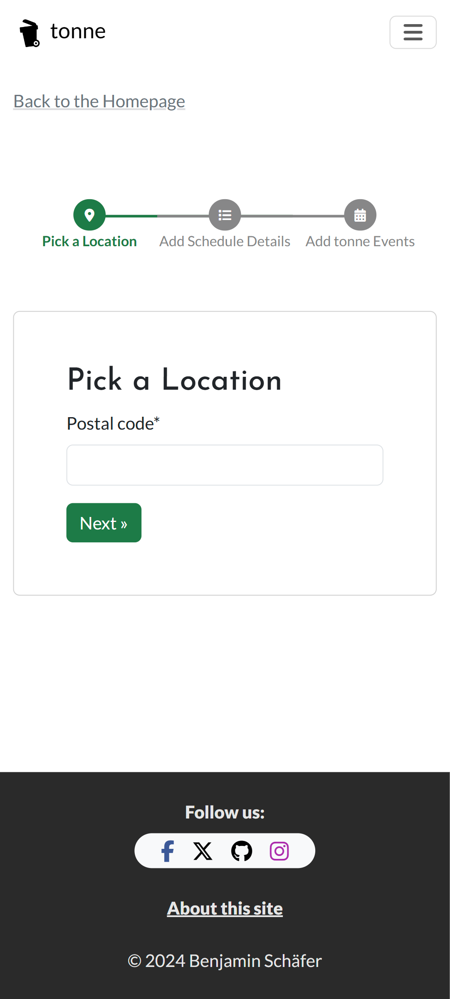

# 🌍 Eco-Conscious Waste Management App: Your Partner in Green Living! 🌿
[Experience our live website here!](https://tonne-waste-reminders-a6836f2888b0.herokuapp.com/)

[](https://github.com/benschaf/waste-schedule/commits/main)
[](https://github.com/benschaf/waste-schedule/commits/main)
[](https://github.com/benschaf/waste-schedule)
[](https://github.com/benschaf/waste-schedule/issues)

Welcome to the Waste Management App, your go-to solution in the quest for efficient and eco-friendly waste handling! 🚀


⤴️ preview of the site on different devices

Our app is not just about managing waste, it's about creating a sustainable future, one notification at a time. Here's what we offer:

1. 📅 **Waste Collection Reminders:**
    - Say goodbye to forgotten collection days! Our intuitive dashboard allows you to search for your postcode and receive real-time reminders in your calendar. Whether it's the Grüne Tonne or Gelbe Tonne, our timely notifications ensure that you will never have to rush out your bins again in the last second.

2. 👥 **Community Interaction:**
    - Be part of the green revolution! Users can upload and rate waste collection schedules, ensuring the highest level of accuracy and reliability.
    - Everyone can Customize existing schedules and actively contribute to your communities.

Join us in building a community-driven resource that's making a real difference. Together, we can create a cleaner, greener world - one bin at a time! 🌳

## UX

### Colour Scheme
I used a very subtle green and white colour scheme to reflect the eco-friendly nature of the app. Coolors was used to generate the [colour palette](https://coolors.co/25a55f-2a2a2a-1c7b47-e6e6e6-57d992).


Screenshot of the colour palette from Coolors

- `--pigment-green: #25a55f` - used for primary buttons and highlights
- `--emerald: #57d992` - used for secondary buttons and highlights
- `--dark-spring-green: #1c7b47` - used for darker highlights
- `--jet: #2a2a2a` - used for bright backgrounds
- `--platinum: #e6e6e6` - used for light buttons

In order to have easier access to my colour scheme within my code i used CSS `:root` variables. These also include transparent versions of the colours for backgrounds.

```css
:root {
    --primary-color: #25a55f;
    --secondary-color: #57d992;
    --darker-secondary-color: #1c7b47;
    --primary-transparent-background: #25a55f45;
    --secondary-transparent-background: #1c7b47db;
    --dark-background: #2a2a2a;
    --light-background: #e6e6e6;
}
```


```css
:root {
    /* P = Primary | S = Secondary */
    --p-text: #000000;
    --p-highlight: #E84610;
    --s-text: #4A4A4F;
    --s-highlight: #009FE3;
    --white: #FFFFFF;
    --black: #000000;
}
```

### Typography

- [Josefin Sans](https://fonts.google.com/specimen/Josefin+Sans) was used for all titles and subheadings. It's a modern, elegant font that stands out, complementing the otherwise minimalistic colour scheme and design.

- [Lato](https://fonts.google.com/specimen/Lato) was used for body and all other text. It's a clean, easy-to-read font that ensures a smooth user experience.

- [Font Awesome](https://fontawesome.com) icons were used throughout the site, such as the social media icons in the footer.

## Wireframes
To follow best practice, wireframes were developed for mobile, tablet, and desktop sizes.
I've used [draw.io](https://balsamiq.com/wireframes) to design my site wireframes.

View the [original draw.io file](https://drive.google.com/file/d/1KmW3ppV6V6eGe11EsY1J0-Z69dtKagAU/view?usp=sharing) of the wireframes. (click on the "Open with" button and select "draw.io")

| Page | Mobile Wireframe | Tablet Wireframe | Desktop Wireframe |
| --- | --- | --- | --- |
| Landing Page |  |  |  |
| Schedule List |  |  |  |
| Schedule Detail and Editor |  |  |  |
| Dashboard |  |  |  |
| Schedule Builder |  |  |  |

## User Stories

View the [user story map](https://github.com/users/benschaf/projects/9/views/2) created for this project using Github Projects. It includes all user stories and makes them easier to manage as they are grouped by Epic and MoSCoW priority.


### MoSCoW Prioritization: Must Have
Below are the user stories that were prioritized as **Must Have**.

For all user stories, please refer to the [User Story Map](https://github.com/users/benschaf/projects/9/views/2).

#### Epic: Landing Page optimization

* [#3](https://github.com/benschaf/waste-schedule/issues/3) As a user, I want an intuitive landing page that explains the app’s purpose and features clearly, so that I can quickly understand how to use it.
* [#13](https://github.com/benschaf/waste-schedule/issues/13) As a user I can instantly find relevant information for my area when visiting the website so that I can get right into setting up the reminders I came for

#### Epic: Picking a Schedule

* [#5](https://github.com/benschaf/waste-schedule/issues/5) As a user, I want to be able to browse waste collection schedules for my area without logging in, so that I can explore available options easily.
* [#6](https://github.com/benschaf/waste-schedule/issues/6) As a user, I want to only have to log in, when I want to subscribe to a schedule or make a schedule.
* [#14](https://github.com/benschaf/waste-schedule/issues/14) As a user I can click on a specific waste collection schedule from the search results and view detailed information about that schedule so that I can confirm that it's helpful for me
* [#15](https://github.com/benschaf/waste-schedule/issues/15) As a user, I can subscribe to waste collection schedules so that I receive timely reminders for upcoming collection events.

#### Epic: Managing and recieving reminders

* [#17](https://github.com/benschaf/waste-schedule/issues/17) As a user I can view a dashboard that provides relevant information on my subscribed schedules so that I can stay organized and have an overview of what I subscribed to.

#### Epic: Upload waste collection Schedules

* [#10](https://github.com/benschaf/waste-schedule/issues/10) As a user, I want to upload my community’s waste collection schedule, so that others can benefit from accurate information.

#### Epic: Rate and Comment on waste collection Schedules

* [#12](https://github.com/benschaf/waste-schedule/issues/12) As a user, I want to verify the accuracy of uploaded schedules by comparing them with official waste calendars or images, so that I can trust the data.
* [#11](https://github.com/benschaf/waste-schedule/issues/11) As a user, I want to rate and provide feedback on uploaded schedules to help the community, so that we collectively improve waste management.
* [#18](https://github.com/benschaf/waste-schedule/issues/18) As a user who commented on a schedule I can edit or delete my comment so that I can refine or retract my feedback.
* [#19](https://github.com/benschaf/waste-schedule/issues/19) As a user I can like or express appreciation for a specific waste collection schedule so that I can acknowledge well-maintained schedules.

### Flowchart
The following flowchart depicts possible user journeys in the waste management app. The app tries to let the user do as much as possible without having to sign up or log in. Only when the user has to perform any kind of CRUD operation, they are asked to sign up or log in.


## Features

### Existing Features

#### Inviting landing Page

When first visiting the site, users are greeted with a clean, modern, and inviting landing page. It includes a hero image, a brief description of the site, and a call-to-action form to get started.

The landing page is designed to be simple and user-friendly, providing a quick overview of the site's purpose and functionality. It encourages users to explore the site further and get started with their waste management journey.


project files: [index.html](core/templates/core/index.html)

#### Navigation Bar with the most important links

The navigation bar is fixed at the top of the page, ensuring easy access to the most important links. It includes the logo (which is a link to the homepage), links to the schedule list, the schedule builder, the dashboard and login/register.

The navigation bar is designed to be simple and intuitive, providing quick access to the site's main features. It is responsive and collapses into a hamburger menu on smaller screens using the Bootstrap CSS framework.


project files: [base.html](templates/base.html)

#### Footer with social media links

The footer includes links to the site's social media profiles, such as Facebook, Twitter, and Instagram. It also includes a link to the About page and displays a copyright notice.

The footer is designed to be simple and unobtrusive, providing additional information and links for users who are interested.


project files: [base.html](templates/base.html)

#### About Page

The About page provides a brief overview of the site's purpose and the creator. It also identifies the site as a Code Institute student project.

The About page is designed to be informative and engaging, providing users with additional context and background information. It helps to establish trust and credibility with users, ensuring they feel comfortable using the site.


project files: [about.html](core/templates/core/about.html)

#### Schedule Search Bar and List

The schedule search bar allows users to search for their postcode and receive a list of waste collection schedules. The search bar is displayed prominently on as the CTA on the Landing page and in the Schedule List page.

Once the user has entered their postcode, they are presented with a list set of schedule cards that match their search criteria. From here, they can already like and/or subscribe to a schedule.

The schedule list has enabled pagination, so that the user can easily navigate through the list of schedules.

The search bar and list are designed to be simple and intuitive, providing users with a quick and easy way to find the information they need.


project files: [schedule_list.html](wasteschedules/templates/wasteschedules/schedule_list.html), [index.js](static/js/index.js)

#### Schedule Detail View

When a user clicks on a schedule card, they are taken to the schedule detail view. Here, they can see all the details of the schedule, including the waste types, collection days, and any additional notes. They can also like and subscribe to the schedule.

Below the schedule details is a list of user comments, allowing users to share their thoughts and experiences with the schedule.

For the schedule as well as for each comment, the owner of the schedule/comment can edit or delete it.

The schedule detail view is designed to be informative and engaging, providing users with all the information and possibilites to take action they need in one place.


project files: [schedule_detail.html](wasteschedules/templates/wasteschedules/schedule_detail.html), [comments.js](static/js/comments.js), [only_schedule.js](static/js/only_schedule.js)

#### User Likes, Subscriptions, and Comments

Users can like and subscribe to schedules, as well as leave comments. This allows them to interact with the site and the community, providing feedback and sharing their experiences.

A like is a simple way for users to show their appreciation for a schedule. Other users can see how many likes a schedule has received - thereby indicating its popularity and reliability.

Subscribing to a schedule means that the user will be able to set up notifications for this schedule. A subscribed to schedule will be displayed on the user's dashboard. Subscriptions also contribute to indicate the reliability of a schedule.

Schedules and likes can be added and removed by the user via the schedule list, schedule detail and dashboard pages.

Comments allow users to share their thoughts and experiences on a schedule. They can ask questions, provide feedback, or share additional information. Comments are displayed below the schedule details and can be edited or deleted by the owner. Comments can be added, edited and deleted via the schedule detail page.

The like, subscribe and comment features are designed to encourage user interaction and engagement, creating a sense of community and trust.



project files: [comments.js](static/js/comments.js), [schedule_detail.html](wasteschedules/templates/wasteschedules/schedule_detail.html), [schedule_list.html](wasteschedules/templates/wasteschedules/schedule_list.html), [dashboard.html](wasteschedules/templates/wasteschedules/dashboard.html)


#### Schedule Builder

The schedule builder allows users to create a new waste collection schedule. They can add waste types, collection days, and any additional notes. Once the schedule is created, it is added to the database and can be viewed by other users.

The schedule builder is split up into 3 steps:
1. Location Form

Here the user can enter their postcode. If a schedule for this postcode already exists, the user is notified.

2. Schedule Title / Description / Image Form

Here the user can enter a title and description for the schedule. They can also **upload an image** to help validate the schedule.

3. Collection Events Calendar Form

Here the user can add collection events to the schedule. They can select the waste type, the collection day directly from a calendar. The calendar is implemented using the [FullCalendar](https://fullcalendar.io/) library.

The schedule builder is designed to be intuitive and user-friendly, providing a step-by-step process for creating a new schedule. It allows users to contribute to the site and share their knowledge with the community.

| Location Form | Schedule Title / Description / Image Form | Collection Events Calendar Form |
| --- | --- | --- |
|  |  |  |

Collection Events Calendar Form

project files: [location_form.html](schedulebuilder/templates/schedulebuilder/location_form.html), [schedule_form.html](schedulebuilder/templates/schedulebuilder/schedule_form.html), [calendar.html](schedulebuilder/templates/schedulebuilder/calendar.html), [edit_calendar.js](static/js/edit_calendar.js)

#### Dashboard

The dashboard is a user-specific page that displays all the schedules the user has created. It also displays any schedules the user has subscribed to.

From the dashboard, the user can edit or delete their schedules, as well as unsubscribe from schedules they are no longer interested in. It provides a quick overview and a general starting point for established users that are already familiar with the site.


project files: [dashboard.html](wasteschedules/templates/wasteschedules/dashboard.html)

#### User Registration and Login

Users can register for an account on the site, providing a username and password. Once registered, they can log in to the site using their credentials. They also have the option to register and sign in using their Google account. This feature is implemented using the Django Allauth package.

The site tries to prompt the user to register or log in only when it is necessary. This means that the user can do as much as possible without having to sign up or log in. Only when the user has to perform any kind of CRUD operation, they are asked to sign up or log in. For an overview of the user flow, see the [flowchart](#flowchart).

| | |
| --- | --- |
|  | screenshot |

project files: find the adapted Allauth templates in the [templates/account](templates/account) folder.

#### Django messages

Django messages are used to provide feedback to the user. They are displayed at the top of the page and disappear after a few seconds. They are used to confirm successful actions, such as creating a schedule, as well as to provide error messages, such as when a user tries to access a page they are not authorized to view.

The messages are designed to be unobtrusive and informative, providing users with feedback on their actions and helping them navigate the site.

| | |
| --- | --- |
|  | screenshot |

project files: [base.html](templates/base.html)

#### Responsive Design

The site is fully responsive and optimized for all devices. It looks great on mobile, tablet, and desktop screens, ensuring a smooth user experience no matter the device. The responsive design was implemented using the Bootstrap CSS framework. Custom CSS was used to create a unique design that fits the site's theme.

project files: all template files and [styles.css](static/css/styles.css) (for custom styles)

### Future Features

All Ideas for Future Features are organized as user Stories by Epic and MoSCoW priority in the [User Story Map](https://github.com/users/benschaf/projects/9/views/2)

These are my three favorite ideas for future features:
- **[Issue #8](https://github.com/benschaf/waste-schedule/issues/8): User Notifications**: A feature that sends users actual real time notifications to remind them of their waste collection days. Sadly, this feature is not in the scope of this project because it cant really be implemented when using a free Heroku account that isn't able to keep the server running all the time.
- **[Issue #40](https://github.com/benschaf/waste-schedule/issues/40) Gamification and Household sharing** A feature that allows members of a household to share their schedules and compete / collaborate with each other. This feature would also include a leaderboard and achievements.
- **[Issue #41](https://github.com/benschaf/waste-schedule/issues/41)Local Waste Collection Services**: A feature that allows users to find local waste collection services in their area, such as recycling centers, composting facilities, and hazardous waste disposal sites.


## Tools & Technologies Used
- [](https://tim.2bn.dev/markdown-builder) used to generate README and TESTING templates.
- [](https://git-scm.com) used for version control. (`git add`, `git commit`, `git push`)
- [](https://github.com) used for secure online code storage.
- [](https://gitpod.io) used as a cloud-based IDE for development.
- [](https://en.wikipedia.org/wiki/HTML) used for the main site content.
- [](https://en.wikipedia.org/wiki/CSS) used for the main site design and layout.
- [](https://www.javascript.com) used for user interaction on the site.
- [](https://www.python.org) used as the back-end programming language.
- [](https://www.heroku.com) used for hosting the deployed back-end site.
- [](https://getbootstrap.com) used as the front-end CSS framework for modern responsiveness and pre-built components.
STILL NEED TO IMPLEMENT JS TESTING
- [](https://jestjs.io) used for automated JavaScript testing.
- [](https://www.djangoproject.com) used as the Python framework for the site.
- [](https://www.postgresql.org) used as the relational database management.
- [](https://dbs.ci-dbs.net) used as the Postgres database from Code Institute.
- [](https://cloudinary.com) used for online static file storage.
AM I USING THIS??
- [](https://whitenoise.readthedocs.io) used for serving static files with Heroku.
- [](https://fontawesome.com) used for the icons.
- [](https://chat.openai.com) used to help debug, troubleshoot, and explain things.
- [](https://coolors.co) used to generate the colour palette.
- [](https://draw.io) used to design the wireframes.
- [](https://pixlr.com) used to edit images.


## Database Design
A relational database was used for this project. The database schema was designed using [dbdiagram.io](https://dbdiagram.io) before development began. The schema was then implemented using Django's built-in ORM. Throughout the development process, the schema was adjusted and updated as needed. The initial and the final version of the schema can be found below.

### Initial ERD
At the core of the database design is the `Schedule` model. This model represents a waste collection schedule and includes fields for the schedule title, description, and image. On the left side of the ERD view below are models that allow users to like, comment on, and subscribe to schedules. On the right side are models that handle individual collection events. They adhere to the [RRule standard](https://github.com/jkbrzt/rrule), which allows for complex recurring events to be defined.


Link to the [ERD](https://dbdiagram.io/e/66178e7003593b6b61bbb163/6618fa1203593b6b61d512e4)

### Final ERD
I have used `pygraphviz` and `django-extensions` to auto-generate an ERD.

The steps taken were as follows:
- In the terminal: `sudo apt update`
- then: `sudo apt-get install python3-dev graphviz libgraphviz-dev pkg-config`
- then type `Y` to proceed
- then: `pip3 install django-extensions pygraphviz`
- in my `settings.py` file, I added the following to my `INSTALLED_APPS`:
```python
INSTALLED_APPS = [
    ...
    'django_extensions',
    ...
]
```
- back in the terminal: `python3 manage.py graph_models -a -o erd.png`
- dragged the new `erd.png` file into my `documentation/` folder
- removed `'django_extensions',` from my `INSTALLED_APPS`
- finally, in the terminal: `pip3 uninstall django-extensions pygraphviz -y`


source for django ERD generation: [medium.com](https://medium.com/@yathomasi1/1-using-django-extensions-to-visualize-the-database-diagram-in-django-application-c5fa7e710e16)

**Note about migration files:** While debugging the project, migration files were deleted and recreated which results in the `migrations` folders only containing one migration file each. The migration history can be recreated in older versions of the github repository. Thanks for John from the tutor team for the help with debugging my migrations! (see [the relevant commit](https://github.com/benschaf/waste-schedule/commit/ea26c6f6037916747e75c8918a234437f2f3ae20))


## Agile Development Process

### GitHub Projects

[GitHub Projects](https://github.com/benschaf/waste-schedule/projects) served as an Agile tool for this project.
It isn't a specialized tool, but with the right tags and project creation/issue assignments, it can be made to work.

Through it, a user story map was created, and issues were managed in an Agile way. User stories were created using a custom **User Story Template**.

User stories are grouped by Epic and MoSCoW priority. The epics were determined before development began as part of the design process. In depth information about the conception of the idea for the site and the User Stories can be found under the Design Thinking Progress section at the bottom of this file.

Throughout the development process, user stories were reevaluated after each iteration and adjusted accordingly.


#### MoSCoW Prioritization

I've decomposed my Epics into stories prior to prioritizing and implementing them.
Using this approach, I was able to apply the MoSCow prioritization as custom project fields to my user stories within the project settings on GitHub.

- **Must Have**: guaranteed to be delivered (*max 60% of stories*)
- **Should Have**: adds significant value, but not vital (*the rest ~20% of stories*)
- **Could Have**: has small impact if left out (*20% of stories*)
- **Won't Have**: not a priority for this iteration

### GitHub Issues

[GitHub Issues](https://github.com/benschaf/waste-schedule/issues) served as an another Agile tool.

Github issues was mainly used to track bugs and smaller feature requests that weren't big enough to be considered a user story. They also contain the user stories which means that filtering is key to keep the overview.

- [Open Issues](https://github.com/benschaf/waste-schedule/issues) [](https://github.com/benschaf/waste-schedule/issues)

    

- [Closed Issues](https://github.com/benschaf/waste-schedule/issues?q=is%3Aissue+is%3Aclosed) [](https://github.com/benschaf/waste-schedule/issues?q=is%3Aissue+is%3Aclosed)

    

**Note about the screenshots:** The screenshots do not show the complete list of issues as there would be too many. They are meant to give an impression of how the issues are structured and how they are used in the project. The actual list of issues can be found by following the links above.


## Testing

> [!NOTE]
> For all testing, please refer to the [TESTING.md](TESTING.md) file.

## Deployment
The live deployed application can be found deployed on [Heroku](https://fdfsaf1beedfcc0.herokuapp.com).

### PostgreSQL Database

This project uses a [Code Institute PostgreSQL Database](https://dbs.ci-dbs.net).

To obtain my own Postgres Database from Code Institute, I followed these steps:

- Signed-in to the CI LMS using my email address.
- An email was sent to me with my new Postgres Database.

> [!CAUTION]
> - PostgreSQL databases by Code Institute are only available to CI Students.
> - You must acquire your own PostgreSQL database through some other method if you plan to clone/> > fork this repository.
> - Code Institute students are allowed a maximum of 8 databases.
> - Databases are subject to deletion after 18 months.

### Cloudinary API

This project uses the [Cloudinary API](https://cloudinary.com) to store media assets online, due to the fact that Heroku doesn't persist this type of data.

To obtain your own Cloudinary API key, create an account and log in.

- For *Primary interest*, you can choose *Programmable Media for image and video API*.
- Optional: *edit your assigned cloud name to something more memorable*.
- On your Cloudinary Dashboard, you can copy your **API Environment Variable**.
- Be sure to remove the `CLOUDINARY_URL=` as part of the API **value**; this is the **key**.

### Heroku Deployment

This project uses [Heroku](https://www.heroku.com), a platform as a service (PaaS) that enables developers to build, run, and operate applications entirely in the cloud.

Deployment steps are as follows, after account setup:

- Select **New** in the top-right corner of your Heroku Dashboard, and select **Create new app** from the dropdown menu.
- Your app name must be unique, and then choose a region closest to you (EU or USA), and finally, select **Create App**.
- From the new app **Settings**, click **Reveal Config Vars**, and set your environment variables.

> [!IMPORTANT]
> This is a sample only; you would replace the values with your own if cloning/forking my repository.

| Key | Value |
| --- | --- |
| `CLOUDINARY_URL` | user's own value |
| `DATABASE_URL` | user's own value |
| `DISABLE_COLLECTSTATIC` | 1 (*this is temporary, and can be removed for the final deployment*) |
| `SECRET_KEY` | user's own value |

Heroku needs three additional files in order to deploy properly.

- requirements.txt
- Procfile
- runtime.txt

You can install this project's **requirements** (where applicable) using:

- `pip3 install -r requirements.txt`

If you have your own packages that have been installed, then the requirements file needs updated using:

- `pip3 freeze --local > requirements.txt`

The **Procfile** can be created with the following command:

- `echo web: gunicorn app_name.wsgi > Procfile`
- *replace **app_name** with the name of your primary Django app name; the folder where settings.py is located*

The **runtime.txt** file needs to know which Python version you're using:
1. type: `python3 --version` in the terminal.
2. in the **runtime.txt** file, add your Python version:
	- `python-3.9.18`

For Heroku deployment, follow these steps to connect your own GitHub repository to the newly created app:

Either:

- Select **Automatic Deployment** from the Heroku app.

Or:

- In the Terminal/CLI, connect to Heroku using this command: `heroku login -i`
- Set the remote for Heroku: `heroku git:remote -a app_name` (replace *app_name* with your app name)
- After performing the standard Git `add`, `commit`, and `push` to GitHub, you can now type:
	- `git push heroku main`

The project should now be connected and deployed to Heroku!

### Local Deployment

This project can be cloned or forked in order to make a local copy on your own system.

For either method, you will need to install any applicable packages found within the *requirements.txt* file.

- `pip3 install -r requirements.txt`.

You will need to create a new file called `env.py` at the root-level,
and include the same environment variables listed above from the Heroku deployment steps.

> [!IMPORTANT]
> This is a sample only; you would replace the values with your own if cloning/forking my repository.

Sample `env.py` file:

```python
import os

os.environ.setdefault("CLOUDINARY_URL", "user's own value")
os.environ.setdefault("DATABASE_URL", "user's own value")
os.environ.setdefault("SECRET_KEY", "user's own value")

# local environment only (do not include these in production/deployment!)
os.environ.setdefault("DEBUG", "True")
```

Once the project is cloned or forked, in order to run it locally, you'll need to follow these steps:

- Start the Django app: `python3 manage.py runserver`
- Stop the app once it's loaded: `CTRL+C` or `⌘+C` (Mac)
- Make any necessary migrations: `python3 manage.py makemigrations`
- Migrate the data to the database: `python3 manage.py migrate`
- Create a superuser: `python3 manage.py createsuperuser`
- Load fixtures: `python3 manage.py loaddata db2.json` (note that one of the users in the fixture is a superuser)
- Everything should be ready now, so run the Django app again: `python3 manage.py runserver`

#### Cloning

You can clone the repository by following these steps:

1. Go to the [GitHub repository](https://github.com/benschaf/waste-schedule)
2. Locate the Code button above the list of files and click it
3. Select if you prefer to clone using HTTPS, SSH, or GitHub CLI and click the copy button to copy the URL to your clipboard
4. Open Git Bash or Terminal
5. Change the current working directory to the one where you want the cloned directory
6. In your IDE Terminal, type the following command to clone my repository:
	- `git clone https://github.com/benschaf/waste-schedule.git`
7. Press Enter to create your local clone.

Alternatively, if using Gitpod, you can click below to create your own workspace using this repository.

[](https://gitpod.io/#https://github.com/benschaf/waste-schedule)

Please note that in order to directly open the project in Gitpod, you need to have the browser extension installed.
A tutorial on how to do that can be found [here](https://www.gitpod.io/docs/configure/user-settings/browser-extension).

#### Forking

By forking the GitHub Repository, we make a copy of the original repository on our GitHub account to view and/or make changes without affecting the original owner's repository.
You can fork this repository by using the following steps:

1. Log in to GitHub and locate the [GitHub Repository](https://github.com/benschaf/waste-schedule)
2. At the top of the Repository (not top of page) just above the "Settings" Button on the menu, locate the "Fork" Button.
3. Once clicked, you should now have a copy of the original repository in your own GitHub account!

## Credits

### Content


<!-- CREDITS_START -->
All the Credits and hyperlinks can be found in the respective files on the indicated lines.

Note that the list of credits below is automatically generated from the project files using the [copy-credits.py](copy-credits.py) script.
The script was written by me, with much help from the Microsoft Edge Copilot.
| File | Notes | Source |
| --- | --- | --- |
| [index.html: Line 20](https://github.com/benschaf/waste-schedule/blob/main/core/templates/core/index.html#L20) | manual input validation using regex pattern | [developer.mozilla.org](https://developer.mozilla.org/en-US/docs/Learn/Forms/Form_validation) |
| [index.html: Line 21](https://github.com/benschaf/waste-schedule/blob/main/core/templates/core/index.html#L21) | regex Pattern (generated using Bing AI) | [www.bing.com](https://www.bing.com/chat) |
| [models.py: Line 38](https://github.com/benschaf/waste-schedule/blob/main/schedulebuilder/models.py#L38) | strftime | [www.programiz.com](https://www.programiz.com/python-programming/datetime/strftime) |
| [test_views.py: Line 59](https://github.com/benschaf/waste-schedule/blob/main/schedulebuilder/test_views.py#L59) | getting django messages from response | [stackoverflow.com](https://stackoverflow.com/questions/2897609/how-can-i-unit-test-django-messages) |
| [views.py: Line 356](https://github.com/benschaf/waste-schedule/blob/main/schedulebuilder/views.py#L356) | update_or_create | [docs.djangoproject.com](https://docs.djangoproject.com/en/5.0/ref/models/querysets/#update-or-create) |
| [views.py: Line 357](https://github.com/benschaf/waste-schedule/blob/main/schedulebuilder/views.py#L357) | dict.get() | [www.w3schools.com](https://www.w3schools.com/python/ref_dictionary_get.asp) |
| [views.py: Line 396](https://github.com/benschaf/waste-schedule/blob/main/schedulebuilder/views.py#L396) | get_kind_display() | [docs.djangoproject.com](https://docs.djangoproject.com/en/3.2/ref/models/instances/#django.db.models.Model.get_FOO_display) |
| [schedule_form.html: Line 21](https://github.com/benschaf/waste-schedule/blob/main/schedulebuilder/templates/schedulebuilder/schedule_form.html#L21) | uploading a file using a form | [www.w3schools.com](https://www.w3schools.com/tags/att_form_enctype.asp) |
| [style.css: Line 2](https://github.com/benschaf/waste-schedule/blob/main/static/css/style.css#L2) | using CSS root variables | [www.w3schools.com](https://www.w3schools.com/css/css3_variables.asp) |
| [style.css: Line 32](https://github.com/benschaf/waste-schedule/blob/main/static/css/style.css#L32) | keyframes | [stackoverflow.com](https://stackoverflow.com/questions/45330061/how-to-flash-a-div-only) |
| [style.css: Line 66](https://github.com/benschaf/waste-schedule/blob/main/static/css/style.css#L66) | Gradient text | [cssgradient.io](https://cssgradient.io/blog/css-gradient-text/) |
| [style.css: Line 177](https://github.com/benschaf/waste-schedule/blob/main/static/css/style.css#L177) | timeline CSS & HTML | [www.bootdey.com](https://www.bootdey.com/snippets/view/timeline-events) |
| [edit_calendar.js: Line 26](https://github.com/benschaf/waste-schedule/blob/main/static/js/edit_calendar.js#L26) | getWeekday | [www.w3schools.com](https://www.w3schools.com/jsref/jsref_getday.asp) |
| [edit_calendar.js: Line 68](https://github.com/benschaf/waste-schedule/blob/main/static/js/edit_calendar.js#L68) | selectedIndex | [www.w3schools.com](https://www.w3schools.com/jsref/prop_select_selectedindex.asp) |
| [edit_calendar.js: Line 163](https://github.com/benschaf/waste-schedule/blob/main/static/js/edit_calendar.js#L163) | query selector | [developer.mozilla.org](https://developer.mozilla.org/en-US/docs/Web/API/Document/querySelector?retiredLocale=de) |
| [edit_calendar.js: Line 213](https://github.com/benschaf/waste-schedule/blob/main/static/js/edit_calendar.js#L213) | adding a year to a date | [developer.mozilla.org](https://developer.mozilla.org/en-US/docs/Web/JavaScript/Reference/Global_Objects/Date/setFullYear) |
| [index.js: Line 1](https://github.com/benschaf/waste-schedule/blob/main/static/js/index.js#L1) | redirecting to a url in javascript | [stackoverflow.com](https://stackoverflow.com/questions/503093/how-can-i-make-a-redirect-page-in-jquery-javascript) |
| [script.js: Line 2](https://github.com/benschaf/waste-schedule/blob/main/static/js/script.js#L2) | popovers | [getbootstrap.com](https://getbootstrap.com/docs/5.2/components/popovers/#overview) |
| [style.css: Line 2](https://github.com/benschaf/waste-schedule/blob/main/staticfiles/css/style.css#L2) | using CSS root variables | [www.w3schools.com](https://www.w3schools.com/css/css3_variables.asp) |
| [style.css: Line 32](https://github.com/benschaf/waste-schedule/blob/main/staticfiles/css/style.css#L32) | keyframes | [stackoverflow.com](https://stackoverflow.com/questions/45330061/how-to-flash-a-div-only) |
| [style.css: Line 66](https://github.com/benschaf/waste-schedule/blob/main/staticfiles/css/style.css#L66) | Gradient text | [cssgradient.io](https://cssgradient.io/blog/css-gradient-text/) |
| [style.css: Line 177](https://github.com/benschaf/waste-schedule/blob/main/staticfiles/css/style.css#L177) | timeline CSS & HTML | [www.bootdey.com](https://www.bootdey.com/snippets/view/timeline-events) |
| [edit_calendar.js: Line 26](https://github.com/benschaf/waste-schedule/blob/main/staticfiles/js/edit_calendar.js#L26) | getWeekday | [www.w3schools.com](https://www.w3schools.com/jsref/jsref_getday.asp) |
| [edit_calendar.js: Line 68](https://github.com/benschaf/waste-schedule/blob/main/staticfiles/js/edit_calendar.js#L68) | selectedIndex | [www.w3schools.com](https://www.w3schools.com/jsref/prop_select_selectedindex.asp) |
| [edit_calendar.js: Line 163](https://github.com/benschaf/waste-schedule/blob/main/staticfiles/js/edit_calendar.js#L163) | query selector | [developer.mozilla.org](https://developer.mozilla.org/en-US/docs/Web/API/Document/querySelector?retiredLocale=de) |
| [edit_calendar.js: Line 213](https://github.com/benschaf/waste-schedule/blob/main/staticfiles/js/edit_calendar.js#L213) | adding a year to a date | [developer.mozilla.org](https://developer.mozilla.org/en-US/docs/Web/JavaScript/Reference/Global_Objects/Date/setFullYear) |
| [index.js: Line 1](https://github.com/benschaf/waste-schedule/blob/main/staticfiles/js/index.js#L1) | redirecting to a url in javascript | [stackoverflow.com](https://stackoverflow.com/questions/503093/how-can-i-make-a-redirect-page-in-jquery-javascript) |
| [script.js: Line 2](https://github.com/benschaf/waste-schedule/blob/main/staticfiles/js/script.js#L2) | popovers | [getbootstrap.com](https://getbootstrap.com/docs/5.2/components/popovers/#overview) |
| [base.html: Line 94](https://github.com/benschaf/waste-schedule/blob/main/templates/base.html#L94) | django messages framework | [docs.djangoproject.com](https://docs.djangoproject.com/en/5.0/ref/contrib/messages/) |
| [only_schedule.html: Line 3](https://github.com/benschaf/waste-schedule/blob/main/templates/only_schedule.html#L3) | sending JSON data to JavaScript | [docs.djangoproject.com](https://docs.djangoproject.com/en/5.0/ref/templates/builtins/#std-templatefilter-json_script) |
| [login.html: Line 29](https://github.com/benschaf/waste-schedule/blob/main/templates/account/login.html#L29) | google sign in button | [developers.google.com](https://developers.google.com/identity/branding-guidelines?hl=de) |
| [signup.html: Line 37](https://github.com/benschaf/waste-schedule/blob/main/templates/account/signup.html#L37) | social Login setup | [www.youtube.com](https://www.youtube.com/watch?v=yO6PP0vEOMc&ab_channel=AkamaiDevRel) |
| [signup.html: Line 38](https://github.com/benschaf/waste-schedule/blob/main/templates/account/signup.html#L38) | documentation for social Locin setup | [docs.allauth.org](https://docs.allauth.org/en/latest/socialaccount/introduction.html) |
| [signup.html: Line 40](https://github.com/benschaf/waste-schedule/blob/main/templates/account/signup.html#L40) | google sign in button | [developers.google.com](https://developers.google.com/identity/branding-guidelines?hl=de) |
| [settings.py: Line 72](https://github.com/benschaf/waste-schedule/blob/main/tonne/settings.py#L72) | cloudinary saving using HTTPs (this is a link to the code institute internal Slack server) | [code-institute-room.slack.com](https://code-institute-room.slack.com/archives/C026PTF46F5/p1706622757171679) |
| [test_views.py: Line 8](https://github.com/benschaf/waste-schedule/blob/main/wasteschedules/test_views.py#L8) | django test assertions | [docs.djangoproject.com](https://docs.djangoproject.com/en/5.0/topics/testing/tools/#assertions) |
| [test_views.py: Line 92](https://github.com/benschaf/waste-schedule/blob/main/wasteschedules/test_views.py#L92) | converting a QuerySet to a list | [stackoverflow.com](https://stackoverflow.com/questions/4424435/how-to-convert-a-django-queryset-to-a-list) |
| [test_views.py: Line 256](https://github.com/benschaf/waste-schedule/blob/main/wasteschedules/test_views.py#L256) | refreshing the object from the database | [stackoverflow.com](https://stackoverflow.com/questions/4377861/reload-django-object-from-database) |
| [test_views.py: Line 491](https://github.com/benschaf/waste-schedule/blob/main/wasteschedules/test_views.py#L491) | converting lists with different orders to sets to compare them | [www.digitalocean.com](https://www.digitalocean.com/community/tutorials/how-to-compare-two-lists-in-python) |
| [views.py: Line 21](https://github.com/benschaf/waste-schedule/blob/main/wasteschedules/views.py#L21) | class based views | [docs.djangoproject.com](https://docs.djangoproject.com/en/5.0/ref/class-based-views/) |
| [views.py: Line 74](https://github.com/benschaf/waste-schedule/blob/main/wasteschedules/views.py#L74) | adding an annotation to each object in a list | [docs.djangoproject.com](https://docs.djangoproject.com/en/5.0/topics/db/aggregation/) |
| [views.py: Line 77](https://github.com/benschaf/waste-schedule/blob/main/wasteschedules/views.py#L77) | passing only the id field value to the template | [docs.djangoproject.com](https://docs.djangoproject.com/en/5.0/ref/models/querysets/#values-list) |
| [views.py: Line 101](https://github.com/benschaf/waste-schedule/blob/main/wasteschedules/views.py#L101) | additional context data in class based views | [docs.djangoproject.com](https://docs.djangoproject.com/en/5.0/topics/class-based-views/generic-display/) |
| [views.py: Line 122](https://github.com/benschaf/waste-schedule/blob/main/wasteschedules/views.py#L122) | checking wether a queryset contains any items | [docs.djangoproject.com](https://docs.djangoproject.com/en/5.0/ref/models/querysets/#django.db.models.query.QuerySet.exists) |
| [views.py: Line 123](https://github.com/benschaf/waste-schedule/blob/main/wasteschedules/views.py#L123) | authenticating the logged in user | [docs.djangoproject.com](https://docs.djangoproject.com/en/5.0/topics/auth/default/#authentication-in-web-requests) |
| [views.py: Line 136](https://github.com/benschaf/waste-schedule/blob/main/wasteschedules/views.py#L136) | using the LoginRequiredMixin | [docs.djangoproject.com](https://docs.djangoproject.com/en/5.0/topics/auth/default/#the-loginrequiredmixin-mixin) |
| [views.py: Line 170](https://github.com/benschaf/waste-schedule/blob/main/wasteschedules/views.py#L170) | finding class based view methods | [www.brennantymrak.com](https://www.brennantymrak.com/articles/createviewdiagram) |
| [views.py: Line 179](https://github.com/benschaf/waste-schedule/blob/main/wasteschedules/views.py#L179) | edit view | [github.com](https://github.com/Code-Institute-Solutions/blog/tree/main/12_views_part_3/05_edit_delete) |
| [views.py: Line 294](https://github.com/benschaf/waste-schedule/blob/main/wasteschedules/views.py#L294) | creating an object | [docs.djangoproject.com](https://docs.djangoproject.com/en/5.0/topics/db/queries/#creating-objects) |
| [views.py: Line 295](https://github.com/benschaf/waste-schedule/blob/main/wasteschedules/views.py#L295) | deleting an object | [docs.djangoproject.com](https://docs.djangoproject.com/en/5.0/topics/db/queries/#deleting-objects) |
| [views.py: Line 296](https://github.com/benschaf/waste-schedule/blob/main/wasteschedules/views.py#L296) | checking if an object exists | [docs.djangoproject.com](https://docs.djangoproject.com/en/5.0/ref/models/querysets/#exists) |
| [views.py: Line 394](https://github.com/benschaf/waste-schedule/blob/main/wasteschedules/views.py#L394) | ics.py library that helps to create ics files | [icspy.readthedocs.io](https://icspy.readthedocs.io/en/stable) |
| [views.py: Line 409](https://github.com/benschaf/waste-schedule/blob/main/wasteschedules/views.py#L409) | creating a download response | [docs.djangoproject.com](https://docs.djangoproject.com/en/5.0/ref/request-response/#fileresponse-objects) |
| [schedule_detail.html: Line 147](https://github.com/benschaf/waste-schedule/blob/main/wasteschedules/templates/wasteschedules/schedule_detail.html#L147) | crispy forms | [github.com](https://github.com/Code-Institute-Solutions/blog/tree/main/12_views_part_3/01_posting_to_database) |
| [schedule_detail.html: Line 173](https://github.com/benschaf/waste-schedule/blob/main/wasteschedules/templates/wasteschedules/schedule_detail.html#L173) | modals | [getbootstrap.com](https://getbootstrap.com/docs/5.2/components/modal/) |
| [schedule_detail.html: Line 174](https://github.com/benschaf/waste-schedule/blob/main/wasteschedules/templates/wasteschedules/schedule_detail.html#L174) | passisng data attributes to js | [blog.webdevsimplified.com](https://blog.webdevsimplified.com/2020-10/javascript-data-attributes/) |
| [schedule_detail.html: Line 175](https://github.com/benschaf/waste-schedule/blob/main/wasteschedules/templates/wasteschedules/schedule_detail.html#L175) | passing the CSRF Token and using it in js | [stackoverflow.com](https://stackoverflow.com/questions/47527120/how-to-add-assign-csrf-token-in-the-html-submit-form) |
| [schedule_list.html: Line 20](https://github.com/benschaf/waste-schedule/blob/main/wasteschedules/templates/wasteschedules/schedule_list.html#L20) | manual input validation using a regex pattern | [developer.mozilla.org](https://developer.mozilla.org/en-US/docs/Learn/Forms/Form_validation) |
| [schedule_list.html: Line 64](https://github.com/benschaf/waste-schedule/blob/main/wasteschedules/templates/wasteschedules/schedule_list.html#L64) | popovers | [getbootstrap.com](https://getbootstrap.com/docs/5.2/components/popovers/#overview) |
<!-- CREDITS_END -->

Additionaly, [Chris Beams](https://chris.beams.io/posts/git-commit) article "How to Write a Git Commit Message" was used as a guideline for writing commit messages.

### Media

The tonne logo was drawn by me, adapting the design from a [vecteezy graphic](https://de.vecteezy.com/vektorkunst/571076-mulleimer-symbol).

Images for sample Waste Schedules were taken from the following websites and uploaded to Cloudinary as an example usecase in the project:
* [Landkreis Coburg](https://www.landkreis-coburg.de/73-0-Abfallwirtschaft.html)
* [Öhningen Waste Calendar](https://www.oehningen.de/fileadmin/redakteur/Abfallkalender_NEU_%C3%96hningen_2024.pdf)
* [Landkreis Schweinfurt](https://www.landkreis-schweinfurt.de/abfuhrkalender)

All images used in this project were generated using the [Copilot Designer](https://www.bing.com/images/create?cc=de)


### Acknowledgements

- I would like to greatly thank my Code Institute mentor, [Tim Nelson](https://github.com/TravelTimN) for his support throughout the development of this project.
- I would like to thank the [Code Institute](https://codeinstitute.net) tutor team for their assistance and their time with troubleshooting and debugging some project issues.
- I would like to thank my partner for her support and understanding during the development of this project.

---
---

## Design Thinking Process

> [!NOTE]
> This Section is added at the end of the README file to keep it clean and concise. Though it is not part of the usual README structure, it was added to provide a more detailed insight into the project's conception and development process.

The design thinking process was used to develop the idea for this project. The process consists of five stages: Empathise, Define, Ideate, Prototype, and Test. Each stage was used to understand the problem, generate ideas, and create a solution that meets the needs of the target audience.

### Emphatise
For this stage, I created 4 user personas to represent the different types of users that would interact with the app.

For each persona, I considered their "5 Cs" (circumstances, constraints, context, criteria, and compensating behaviors) related to waste management and waste management reminders. This helped me understand their needs and motivations better.

1. **Eco-Conscious Emma**:
    Emma is a young environmental enthusiast living in a bustling city like Berlin. She actively separates her waste into different bins, composts organic materials, and participates in local recycling programs. Emma is passionate about reducing her ecological footprint and encourages her neighbors to do the same. She would appreciate an app that provides real-time reminders for waste collection days, educates users about proper waste sorting, and offers tips on sustainable living.
    - **Circumstances**:
        - Emma faces the problem when she’s juggling work, social commitments, and her passion for environmental sustainability.
    - **Constraints**:
        - Her busy lifestyle often leads to forgetfulness about waste collection days.
        - Lack of clear information on local recycling centers and drop-off points.
    - **Context**:
        - Emma encounters this issue at home, especially during early mornings when she needs to take out her bins.
    - **Criteria**:
        - Solving this problem aligns with Emma’s values of reducing waste and contributing to a greener planet.
    - **Compensating Behaviors**:
        - Emma sets manual reminders on her phone but occasionally misses them due to her hectic schedule.

2. **Busy Bernd**:
    Bernd is a working professional in Munich. His busy schedule often leads to forgetfulness, and he occasionally misses waste collection days. He needs an app that sends notifications a day in advance, reminding him to take out his bins. Bernd also wants information on nearby recycling centers and drop-off points for hazardous waste. A feature that tracks his waste reduction progress would motivate him to be more diligent.
    - **Circumstances**:
        - Bernd’s demanding job and family responsibilities make it challenging for him to remember waste collection days.
    - **Constraints**:
        - Time constraints prevent him from researching local waste management rules thoroughly.
    - **Context**:
        - Bernd faces this issue at home, especially during evenings when he’s exhausted from work.
    - **Criteria**:
        - Solving this problem would reduce stress and prevent missed collections.
    - **Compensating Behaviors**:
        - Bernd relies on neighbors’ cues or waits until he hears the garbage truck to take out his bins.

3. **Senior Sigrid**:
    Sigrid, a retiree in Hamburg, values simplicity. She finds the current waste management system confusing and struggles with the various colored bins. Sigrid needs an app with clear instructions on waste separation, including visual cues. Additionally, a feature that connects her with local volunteers or services for assistance with heavy bins would be helpful.
    - **Circumstances**:
        - Sigrid’s age affects her memory, and she finds the waste separation process confusing.
    - **Constraints**:
        - Physical limitations prevent her from handling heavy bins easily.
    - **Context**:
        - Sigrid encounters this issue at home, especially when she needs to sort waste into different containers.
    - **Criteria**:
        - Solving this problem ensures Sigrid’s independence and reduces frustration.
    - **Compensating Behaviors**:
        - Sigrid asks her neighbor for help or leaves her bins outside for extended periods.

4. **Family-Focused Felix**:
    Felix lives in a suburban area near Frankfurt with his family. Managing waste for a household of four can be overwhelming. He wants an app that syncs with family members’ calendars, reminding everyone about collection days. Felix also seeks advice on minimizing waste, especially with kids in the house. Perhaps the app could gamify waste reduction to involve the whole family.
    - **Circumstances**:
        - Felix manages waste for his family, balancing work, parenting, and household chores.
    - **Constraints**:
        - Coordinating waste collection days among family members is challenging.
    - **Context**:
        - Felix faces this issue both at home and during family discussions.
    - **Criteria**:
        - Solving this problem streamlines family routines and teaches kids responsible waste management.
    - **Compensating Behaviors**:
        - Felix uses sticky notes or a shared calendar to remind everyone about bin days.

### Define
Considering all the user personas, I defined problem statements for each of them:

#### Problem statements:
1. **Eco-Conscious Emma**:
    - **Statement**: “I am Eco-Conscious Emma trying to reduce waste, but the lack of timely reminders due to my busy schedule makes me feel frustrated and guilty.”
    - **Statement**: “I am Eco-Conscious Emma trying to educate my neighbors about waste sorting, but the unclear rules due to insufficient information make me feel determined yet overwhelmed.”
2. **Busy Bernd**:
    - **Statement**: “I am Busy Bernd trying to remember waste collection days, but my forgetfulness due to a hectic work schedule makes me feel stressed and annoyed.”
    - **Statement**: “I am Busy Bernd trying to find local recycling centers, but the lack of time due to work commitments makes me feel overwhelmed and uninformed.”
3. **Senior Sigrid**:
    - **Statement**: “I am Senior Sigrid trying to sort waste, but the confusion due to age-related memory challenges makes me feel frustrated and helpless.”
    - **Statement**: “I am Senior Sigrid trying to handle heavy bins, but my physical limitations due to aging make me feel dependent and anxious.”
4. **Family-Focused Felix**:
    - **Statement**: “I am Family-Focused Felix trying to coordinate family waste routines, but the complexity due to managing a household makes me feel overwhelmed yet responsible.”
    - **Statement**: “I am Family-Focused Felix trying to involve kids in waste reduction, but the lack of guidance due to parenting challenges makes me feel determined and hopeful.”

[!IMPORTANT]
Overwork the problem statement

**Overarching Problem Statement**: In a world grappling with stress and environmental challenges, our project aims to develop an integrated waste management solution that addresses the diverse needs of individuals — ranging from busy professionals and eco-conscious citizens to seniors and families. By providing a platform for community engagement, we strive to minimize the stress and confusion that accompany waste management, fostering a sense of responsibility and empowerment among communities. Our mission is to empower everyone, regardless of age or lifestyle, to actively participate in waste reduction, ultimately fostering a cleaner and greener planet.

### Ideate
Considering the problem statements, I brainstormed potential solutions that could address the needs of each user persona. Here are some ideas already with an added priority value (p1: high priority, p2: medium priority, p3: low priority):

1. **Eco-Conscious Emma**:
    - **Solution 1: Waste Collection Reminders**:
        - **p1** Implement a calendar view that highlights upcoming collection days and allows Emma to set preferences (e.g., reminders a day in advance).
        - **p1** Create a community platform within the app where users like Emma can voluntarily share their waste collection schedules.
        - **p1** Neighbors receive real-time reminders based on shared schedules, fostering a sense of community responsibility.
    - **Solution 2: Educational Resources**:
        - **p2** Include an educational section within the app. Provide clear guidelines on waste sorting, recycling, and composting. Use visual cues (infographics, images) to simplify the information.
        - **p3** Collaborate with local environmental organizations to curate content and host webinars on sustainable living.

2. **Busy Bernd**:
    - **Solution 1: Automated Notifications**:
        - **p1** Upon login, prompt Bernd to input his address and preferred notification settings. Send automated reminders via email or SMS a day before waste collection days.
        - **p1** Allow customization (e.g., specific time of day for reminders) to accommodate Bernd’s schedule.
    - **Solution 2: Nearby Services Locator**:
        - **p3** Integrate a map feature that displays nearby recycling centers, drop-off points, and hazardous waste disposal locations.
        - **p3** Include operating hours, contact information, and directions.

3. **Senior Sigrid**:
    - **Solution 1: Visual Guides**:
        - **p3** Develop an intuitive waste sorting guide with visual icons. Sigrid can easily identify which bin to use based on item categories (e.g., paper, plastic, glass).
        - **p3** Include voice instructions for accessibility.
    - **Solution 2: Assistance Network**:
        - **p3** Create a community feature where neighbors can offer assistance. Sigrid can request help with heavy bins or ask for clarification on waste separation.
        - **p2** Encourage local volunteers to participate.

4. **Family-Focused Felix**:
    - **Solution 1: Family Calendar Integration**:
        - **p2** Allow Felix to invite family members to join the app. Sync the app with their calendars to display waste collection days.
        - **p2** Enable notifications for all family members, ensuring everyone is aware.
    - **Solution 2: Waste Reduction Challenges**:
        - **p3** Gamify waste reduction within the family. Set monthly challenges (e.g., reduce plastic waste, compost more) and track progress.
        - **p3** Award virtual badges or points for achieving goals.

### Prototype
After ideating I created wireframes and content for the prototype of the site which is of course this repository.

Check out the full prototype including wireframes, user stories, and the working site by browsing around the readme and the repository. Also check out the [tonne website](https://tonne-waste-reminders-a6836f2888b0.herokuapp.com/) itself.

### Test
The prototype of the site was tested manually and progamatically to ensure that it is working as intended.
Testing in the sense of design thinking has not been very extensive yet. This will be done in the future.