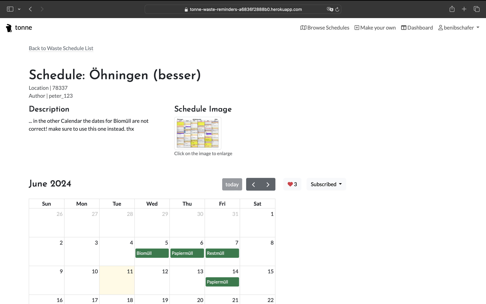
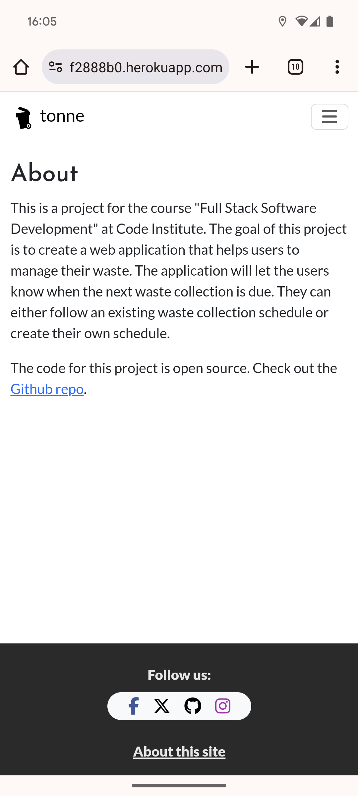
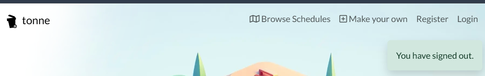
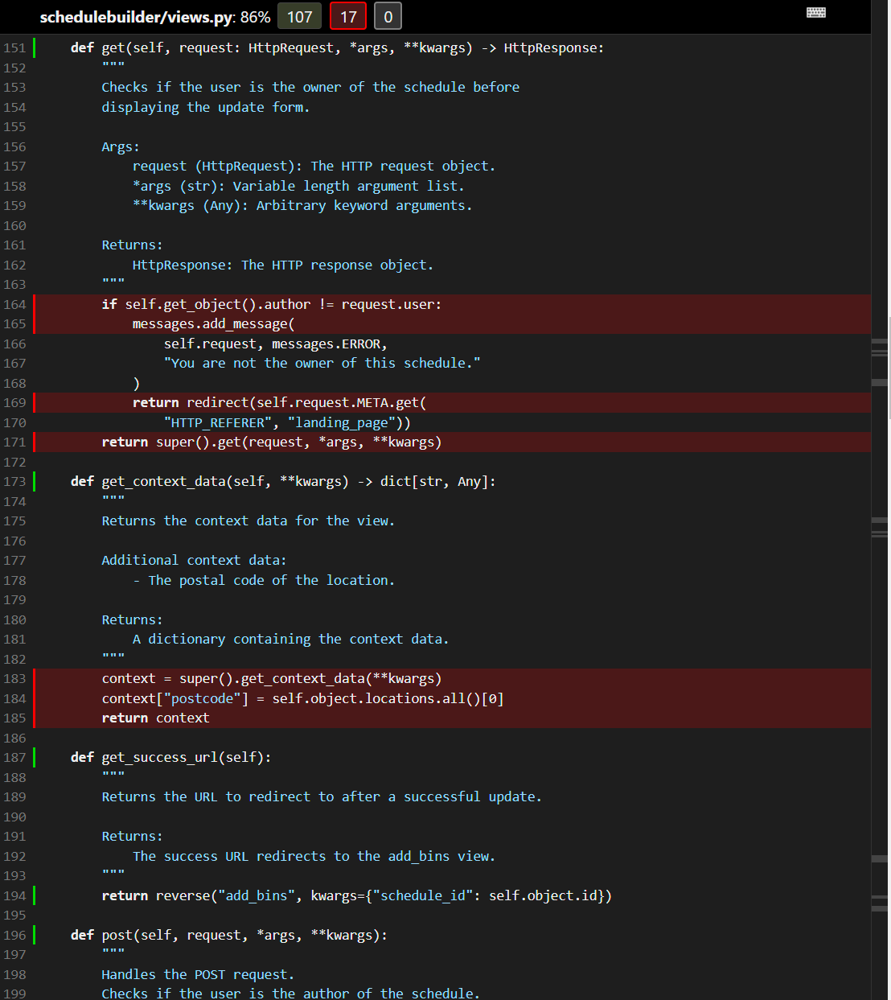

# Testing

> [!NOTE]
> Return back to the [README.md](README.md) file.

## Code Validation

### HTML

I have used the recommended [HTML W3C Validator](https://validator.w3.org) to validate all of my HTML deployed source code. In the table below, the results are labeled by template file that would render the respective page. The results are validated using the live deployed version of the project.

| Directory | File | Screenshot | Notes |
| --- | --- | --- | --- |
| core | about.html |  | no warnings or errors |
| core | index.html |  | no warnings or errors |
| schedulebuilder | calendar.html |  | no warnings or errors |
| schedulebuilder | location_form.html |  | no warnings or errors |
| schedulebuilder | schedule_confirm_delete.html |  | no warnings or errors |
| schedulebuilder | schedule_form.html |  | no warnings or errors |
| schedulebuilder | update_schedule_form.html |  | no warnings or errors |
| templates | 404.html |  | no warnings or errors |
| templates | 500.html |  | no warnings or errors |
| wasteschedules | dashboard.html |  | no warnings or errors |
| wasteschedules | schedule_detail.html |  | no warnings or errors |
| wasteschedules | schedule_list.html |  | no warnings or errors |

There were no issues with the HTML files.

### CSS

I have used the recommended [CSS Jigsaw Validator](https://jigsaw.w3.org/css-validator) to validate the CSS file.


| Directory | File | Screenshot | Notes |
| --- | --- | --- | --- |
| static | style.css |  | no errors, 51 Warnings |

The warnings are due to the vendor prefixes that are used in the CSS file. I added the prefixes using the [Autoprefixer](https://autoprefixer.github.io) tool. The prefixes are necessary for the CSS to work on all browsers.

There is one other warning that is due to the background color and border of the calendar events having the same color value. This was necessary in order to override the default FullCalendar styling.

There were no other issues with the CSS file.

### JavaScript

I have used the recommended [JShint Validator](https://jshint.com) via its command-line interface to validate all of my JavaScript files. for this I installed the jshint package as a dev dependency using the command `npm install jshint --save-dev`. After this I created a `.jshintrc` file in the `static/js` directory of the project with the following content in order to enable ES6 syntax:

```json
{
    "esversion": 6
}
```

I then ran the following command to validate all of my JavaScript files: `npx jshint <directory>/<filename.js>`:

| Directory | File | Screenshot | Notes |
| --- | --- | --- | --- |
| static | comments.js |  | Warning about a function within a loop. This is not an issue as the function is only referencing and not changing the document object. It is used to create a form for each comment. |
| static | dashboard.js |  | Warning about a function within a loop. This is not an issue as the function is only referencing and not changing the document object. It is used to trigger a modal for a click on any download button. |
| static | edit_calendar.js |  | no warnings or errors |
| static | index.js |  | no warnings or errors |
| static | only_schedule.js |  | no warnings or errors |
| static | script.js |  | no warnings or errors |
| static/test | edit_calendar.test.js |  | warning about document.write. This is save to ignore as it is used to load my own HTML template file for testing. |
| static/test | script.test.js |  | no warnings or errors |

There were no additional issues with the JavaScript files.

### Python

I have used the recommended [PEP8 CI Python Linter](https://pep8ci.herokuapp.com) to validate all of my Python files.

Files that are unchanged from the Django template have been excluded from the validation as they are known to be valid.

| Directory | File | CI URL | Screenshot | Notes |
| --- | --- | --- | --- | --- |
| root | copy-credits.py | [PEP8 CI](https://pep8ci.herokuapp.com/https://raw.githubusercontent.com/benschaf/waste-schedule/main/copy-credits.py) |  | no issues |
| core | urls.py | [PEP8 CI](https://pep8ci.herokuapp.com/https://raw.githubusercontent.com/benschaf/waste-schedule/main/core/urls.py) |  | no issues |
| core | views.py | [PEP8 CI](https://pep8ci.herokuapp.com/https://raw.githubusercontent.com/benschaf/waste-schedule/main/core/views.py) |  | no issues |
| schedulebuilder | admin.py | [PEP8 CI](https://pep8ci.herokuapp.com/https://raw.githubusercontent.com/benschaf/waste-schedule/main/schedulebuilder/admin.py) |  | no issues |
| schedulebuilder | forms.py | [PEP8 CI](https://pep8ci.herokuapp.com/https://raw.githubusercontent.com/benschaf/waste-schedule/main/schedulebuilder/forms.py) |  | no issues |
| schedulebuilder | models.py | [PEP8 CI](https://pep8ci.herokuapp.com/https://raw.githubusercontent.com/benschaf/waste-schedule/main/schedulebuilder/models.py) |  | no issues |
| schedulebuilder | urls.py | [PEP8 CI](https://pep8ci.herokuapp.com/https://raw.githubusercontent.com/benschaf/waste-schedule/main/schedulebuilder/urls.py) |  | no issues |
| schedulebuilder | views.py | [PEP8 CI](https://pep8ci.herokuapp.com/https://raw.githubusercontent.com/benschaf/waste-schedule/main/schedulebuilder/views.py) |  | no issues |
| tonne | settings.py | [PEP8 CI](https://pep8ci.herokuapp.com/https://raw.githubusercontent.com/benschaf/waste-schedule/main/tonne/settings.py) |  | no issues |
| tonne | urls.py | [PEP8 CI](https://pep8ci.herokuapp.com/https://raw.githubusercontent.com/benschaf/waste-schedule/main/tonne/urls.py) |  | no issues |
| wasteschedules | admin.py | [PEP8 CI](https://pep8ci.herokuapp.com/https://raw.githubusercontent.com/benschaf/waste-schedule/main/wasteschedules/admin.py) |  | no issues |
| wasteschedules | forms.py | [PEP8 CI](https://pep8ci.herokuapp.com/https://raw.githubusercontent.com/benschaf/waste-schedule/main/wasteschedules/forms.py) |  | no issues |
| wasteschedules | models.py | [PEP8 CI](https://pep8ci.herokuapp.com/https://raw.githubusercontent.com/benschaf/waste-schedule/main/wasteschedules/models.py) |  | no issues |
| wasteschedules | urls.py | [PEP8 CI](https://pep8ci.herokuapp.com/https://raw.githubusercontent.com/benschaf/waste-schedule/main/wasteschedules/urls.py) |  | no issues |
| wasteschedules | views.py | [PEP8 CI](https://pep8ci.herokuapp.com/https://raw.githubusercontent.com/benschaf/waste-schedule/main/wasteschedules/views.py) |  | no issues |

Test Files were validated, too:

| Directory | File | CI URL | Screenshot | Notes |
| --- | --- | --- | --- | --- |
| core | test_views.py | [PEP8 CI](https://pep8ci.herokuapp.com/https://raw.githubusercontent.com/benschaf/waste-schedule/main/core/test_views.py) |  | no issues |
| schedulebuilder | test_forms.py | [PEP8 CI](https://pep8ci.herokuapp.com/https://raw.githubusercontent.com/benschaf/waste-schedule/main/schedulebuilder/test_forms.py) |  | no issues |
| schedulebuilder | test_views.py | [PEP8 CI](https://pep8ci.herokuapp.com/https://raw.githubusercontent.com/benschaf/waste-schedule/main/schedulebuilder/test_views.py) |  | no issues |
| wasteschedules | test_forms.py | [PEP8 CI](https://pep8ci.herokuapp.com/https://raw.githubusercontent.com/benschaf/waste-schedule/main/wasteschedules/test_forms.py) |  | no issues |
| wasteschedules | test_views.py | [PEP8 CI](https://pep8ci.herokuapp.com/https://raw.githubusercontent.com/benschaf/waste-schedule/main/wasteschedules/test_views.py) |  | no issues |

Additionaly to the final testing, pycodestyle was used frequently to test python files locally.

By running the command `pycodestyle --exclude=.vscode/*,*/migrations/* .` in the terminal, I was able to check for any PEP8 violations in all of my Python files. The `--exclude` flag was used to exclude the `.vscode` and `migrations` directories from the test as they are not written by me or automatically generated by Django.

There were no issues with the Python files.

## Browser Compatibility

I've tested my deployed project manually on multiple browsers to check for compatibility issues. I've tested the project on the latest versions of the following browsers:

- Chrome
- Firefox (Developer Edition)
- Edge
- Brave
- Opera
- Safari

See the table below for the compatibility results:

| Browser | Landing | Schedule List | Schedule Detail | Schedule Builder | Dashboard | About | Notes |
| --- | --- | --- | --- | --- | --- | --- | --- |
| Chrome |  |  |  |  |  |  | no issues |
| Firefox (Developer Edition) |  |  |  |  |  |  | no issues |
| Edge |  |  |  |  |  |  | no issues |
| Brave |  |  |  |  |  |  | no issues |
| Opera |  |  |  |  |  |  | no issues |
| Safari |  |  |  |  |  |  | minor differences but no issues |

There were no compatibility issues on any of the browsers tested.

## Responsiveness

I've tested my deployed project on multiple devices to check for responsiveness issues. I've used the Chrome Developer Tools to simulate the devices. I have also tested the project on a physical Google Pixel 6 device.

| Device | Landing | Schedule List | Schedule Detail | Schedule Builder | Dashboard | About | Notes |
| --- | --- | --- | --- | --- | --- | --- | --- |
| Mobile (DevTools: iPhone 12 Pro) |  |  |  |  |  |  | Works as expected |
| Tablet (DevTools: iPad Air) |  |  |  |  |  |  | Works as expected |
| Desktop (1920 x 1080) |  |  |  |  |  |  | Works as expected |
| Google Pixel 6 |  |  |  |  |  |  | Works as expected |

There were no responsiveness issues on any of the devices tested.

## Lighthouse Audit

I've tested my deployed project using the Lighthouse Audit tool in the Chrome Developer Tools to mainly check for accessibility and best practices but also to check for performance and SEO.

| Page | Mobile | Desktop | Notes |
| --- | --- | --- | --- |
| Landing |  |  |  Warnings about performance due to hero image and layout shift (acceptable) |
| About |  |  | Minor warnings |
| Schedule List |  |  | Minor warnings |
| Schedule Detail |  |  | Warnings due to schedule image loading, layout shift, and "links aren't crawlable" |
| Dashboard |  |  | Minor warnings |
| Builder Location |  |  | Minor warnings |
| Builder Schedule |  |  | Minor warnings |
| Builder Calendar |  |  | Minor warnings and "links aren't crawlable" |
| Register |  |  | Minor warnings |
| Login |  |  | Minor warnings |

The "links aren't crawlable" warning is due to FullCalendar which puts some anchor tags into the DOM that aren't actually links. These links not being crawlable is not an issue as they are not meant to be followed by search engines and are only used for FullCalendar's internal functionality.

Besides the warnings mentioned above, there were no issues with the Lighthouse Audit.

## Defensive Programming Testing

Defensive programming was manually tested with the below user acceptance testing.

The follwing criteria were tested:

Forms:
- Users cannot submit an empty form
- Users must enter valid email addresses

Authentication and CRUD Functionality:
- Users cannot brute-force a URL to navigate to a restricted page
- Users cannot perform CRUD functionality while logged-out
- User-A should not be able to manipulate data belonging to User-B, or vice versa
- Non-Authenticated users should not be able to access pages that require authentication
- Standard users should not be able to access pages intended for superusers

| Page | Expectation | Test | Result | Fix | Screenshot |
| --- | --- | --- | --- | --- | --- |
| **Landing** | | | | | |
| | The Postcode field should only accept values made up of 5 digits | Tested the field by entering an empty form, a 6-digit value, a 5-non-digit value, and a 5-digit value | The field only accepted the 5-digit value | Test concluded and passed |  |
| **Navigation Bar** | | | | | |
| | To logged out users, the navigation bar should display the following links: Brwose Schedules, Make your own, Register, Login | Tested the navigation bar while logged out | The navigation bar displayed the following links: Brwose Schedules, Make your own, Dashboard, Register, Login | Test concluded and passed |  |
| | To logged in users, the navigation bar should display the following links: Brwose Schedules, Make your own, Dashboard, Logout | Tested the navigation bar while logged in | The navigation bar displayed the following links: Brwose Schedules, Make your own, Dashboard, Logout | Test concluded and passed |  |
| **Schedule List** | | | | | |
| | The Poscrode field should only accept values made up of 5 digits | Tested the field by entering an empty form, a 6-digit value, a 5-non-digit value, and a 5-digit value | The field only accepted the 5-digit value | Test concluded and passed |  |
| | The Like Button should only perform a CRUD operation for a logged-in user | Tested the button while logged out and while logged in | The button only performed the CRUD operation while logged in | Test concluded and passed |  |
| | The Subscribe Button should only perform a CRUD operation for a logged-in user | Tested the button while logged out and while logged in | The button only performed the CRUD operation while logged in | Test concluded and passed |  |
| | **Schedule Detail** | | | | |
| | The Like Button should only perform a CRUD operation for a logged-in user | Tested the button while logged out and while logged in | The button only performed the CRUD operation while logged in | Test concluded and passed |  |
| | The Subscribe Button should only perform a CRUD operation for a logged-in user | Tested the button while logged out and while logged in | The button only performed the CRUD operation while logged in | Test concluded and passed |  |
| | The Edit Schedule and Delete Schedule Buttons should only be available to the user who created the schedule | Tested the buttons while logged in as the creator and as a different user | The buttons were only available to the creator | Test concluded and passed |  |
| | The Edit Schedule URL should not be accessible if brute forced by a user who is not the creator of the Schedule | Attempted to brute force the [URL](https://tonne-waste-reminders-a6836f2888b0.herokuapp.com/schedule-builder/edit-schedule/kleingarnstadt) | The user was redirected to the login page | Test concluded and passed |  |
| | The Delete Schedule URL should not be accessible if brute forced by a user who is not the creator of the Schedule | Attempted to brute force the [URL](https://tonne-waste-reminders-a6836f2888b0.herokuapp.com/schedule-builder/delete-schedule/kleingarnstadt) | The user was redirected to the login page | Test concluded and passed |  |
| | The Comment field and button should only be available to a logged-in user | Tested the field and button while logged out and while logged in | The field and button were only available while logged in | Test concluded and passed |  |
| | The Comment URL should not be accessible if brute forced by a user | Attempted to brute force the [URL](https://tonne-waste-reminders-a6836f2888b0.herokuapp.com/wasteschedules/schedule-comment/kleingarnstadt) | The user was redirected to the relevant schedule detail page | Test concluded and passed |  |
| | The Comment field should only accept freeform text | Tested the field by entering an empty form, a form with only spaces, and a form with text | The field only accepted the form with text | Test concluded and passed |  |
| | A valid Comment should only be submitted by a logged-in user | Tested the form by entering a comment while logged out and while logged in | The comment was only submitted while logged in | Test concluded and passed |  |
| | The Edit and Delete Buttons for a Comment should only be available to the user who created the Comment | Tested the buttons while logged in as the creator and as a different user | The buttons were only available to the creator | Test concluded and passed |  |
| | The Edit Comment URL should not be accessible if brute forced by a user who is not the creator of the Comment | Attempted to brute force the [URL](https://tonne-waste-reminders-a6836f2888b0.herokuapp.com/wasteschedules/schedule-comment-update/27/kleingarnstadt) | The user was redirected to the landing page and a message was displayed "please use the edit button to edit your comment." | Test concluded and passed |  |
| **Schedule Builder** | | | | | |
| | The Location Form should only be displayed to a logged-in user | Tested the form while logged out and while logged in | The form was only displayed while logged in, when logged out I was redirected to the login page | Test concluded and passed |  |
| | The Location Form should only accept valid data | Tested the form by entering an empty form, a form with only spaces, a form with 5 letters an a form with 5 digits | The form only accepted the form with 5 digits | Test concluded and passed |  |
| | The Schedule Form should only be displayed to a logged-in user | Tested the form while logged out and while logged in | The form was only displayed while logged in, when logged out I was redirected to the login page | Test concluded and passed |  |
| | The Schedule Form title field should only accept freeform text | Tested the field by entering an empty form, a form with only spaces, and a form with text | The field only accepted the form with text | Test concluded and passed |  |
| | The Schedule Form description field should only accept freeform text | Tested the field by entering an empty form, a form with only spaces, and a form with text | The field only accepted the form with text | Test concluded and passed |  |
| | The Schedule Form image field should only accept a valid image | Tested the field by uploading a non-image file and an image file | The field only accepted the image file | Test concluded and passed |  |
| | The Schedule Form image field should not be mandatory | Tested the form by submitting it without an image | The form was submitted without an image | Test concluded and passed |  |
| | The Calendar Form should only be displayed to the logged in owner of the schedule | Tested the form while logged in as the creator and as a different user | The form was only displayed to the creator | Test concluded and passed |  |
| | Clicking on a date in the Calendar Form should open a modal to add an event | Tested the form by clicking on a date | A modal was opened to add an event | Test concluded and passed |  |
| | The add event modal should create a singular or a recurring event. The recurrence should be weekly with the option to skip weeks | Tested the form by adding a singular event and a recurring event | The events were created as expected | Test concluded and passed |  |
| | Clicking on a created event should open a modal to delete the event | Tested the form by clicking on a created event | A modal was opened to delete the event | Test concluded and passed |  |
| | The delete event modal should only give the option to delete the whole series if the event is recurring | Tested the form by clicking on a recurring event | The modal only gave the option to delete the whole series, the other option is greyed out | Test concluded and passed |  |
| | Submitting the delete event modal should delete the event | Tested the form by submitting the delete event modal | The event was deleted | Test concluded and passed |  |
| | The Save button next to the Calendar Form should save the event and redirect to the Schedule Detail page | Tested the form by saving an event | The event was saved and the user was redirected to the Schedule Detail page where the created events were displayed | Test concluded and passed |  |
| **Dashboard** | | | | | |
| | The Dashboard should only be displayed to a logged-in user | Tested the dashboard while logged out and while logged in | The dashboard was only displayed while logged in, when logged out I was redirected to the login page | Test concluded and passed |  |
| | The Dashboard should only display schedules that the user has subscribed to or owns | Tested the dashboard while logged in as the creator and as a different user | The dashboard only displayed the schedules that the user has subscribed to or owns | Test concluded and passed |  |
| | The View Schedule button should redirect to the relevant Schedule Detail page | Tested the button by clicking on it | The user was redirected to the relevant Schedule Detail page | Test concluded and passed |  |
| | The Edit and Delete buttons should only be available to the user who created the schedule | Tested the buttons while logged in as the creator and as a different user | The buttons were only available to the creator | Test concluded and passed |  |
| | The Edit Schedule button should redirect to the relevant Schedule Builder page | Tested the button by clicking on it | The user was redirected to the relevant Schedule Builder page | Test concluded and passed |  |
| | The Delete Schedule button should open a modal to confirm the deletion of the schedule | Tested the button by clicking on it | A modal was opened to confirm the deletion of the schedule | Test concluded and passed |  |
| | The Download button should display a modal with instructions on how to use the ics file | Tested the button by clicking on it | A modal was opened with instructions on how to use the ics file | Test concluded and passed |  |
| | The Download button should download the ics file | Tested the button by clicking on it | The ics file was downloaded | Test concluded and passed |  |
| | **About** | | | | |
| | The About page should be displayed to all users | Tested the page while logged out and while logged in | The page was displayed to all users | Test concluded and passed |  |
| **Register** | | | | | |
| | The Register page should allow the user to Register through their Google account as well as through the form | Tested the page by registering through the form and through the Google account | The user was able to register through both methods | Test concluded and passed |  |
| | **Login** | | | | |
| | The Login page should allow the user to Login through their Google account as well as through the form | Tested the page by logging in through the form and through the Google account | The user was able to log in through both methods | Test concluded and passed |  |

Any issues that were found were fixed and retested. To see a list of all bug issues and fixes, please refer to the [Bugs](#bugs) section.

## User Story Testing

I tested the user stories labeled as "Must-Have" manually to ensure that the project met the user requirements. Screenshots of the tests can be found below:

| User Story | Screenshot |
| --- | --- |
| [#3](https://github.com/benschaf/waste-schedule/issues/3) As a user, I want an intuitive landing page that explains the app’s purpose and features clearly, so that I can quickly understand how to use it. |  |
| [#13](https://github.com/benschaf/waste-schedule/issues/13) As a user I can instantly find relevant information for my area when visiting the website so that I can get right into setting up the reminders I came for |  |
| [#5](https://github.com/benschaf/waste-schedule/issues/5) As a user, I want to be able to browse waste collection schedules for my area without logging in, so that I can explore available options easily. |  |
| [#6](https://github.com/benschaf/waste-schedule/issues/6) As a user, I want to only have to log in, when I want to subscribe to a schedule or make a schedule so that I can explore as much of the site without being distracted by a log in screen. |  |
| [#14](https://github.com/benschaf/waste-schedule/issues/14) As a user I can click on a specific waste collection schedule from the search results and view detailed information about that schedule so that I can confirm that it's helpful for me |  |
| [#15](https://github.com/benschaf/waste-schedule/issues/15) As a user, I can subscribe to waste collection schedules so that I receive timely reminders for upcoming collection events. (notice the download button) |  |
| [#17](https://github.com/benschaf/waste-schedule/issues/17) As a user I can view a dashboard that provides relevant information on my subscribed schedules so that I can stay organized and have an overview of what I subscribed to. |  |
| [#10](https://github.com/benschaf/waste-schedule/issues/10) As a user, I want to upload my community’s waste collection schedule, so that others can benefit from accurate information. |  |
| [#12](https://github.com/benschaf/waste-schedule/issues/12) As a user, I want to verify the accuracy of uploaded schedules by comparing them with official waste calendars or images, so that I can trust the data. |  |
| [#11](https://github.com/benschaf/waste-schedule/issues/11) As a user, I want to rate and provide feedback on uploaded schedules to help the community, so that we collectively improve waste management. |  |
| [#18](https://github.com/benschaf/waste-schedule/issues/18) As a user who commented on a schedule I can edit or delete my comment so that I can refine or retract my feedback. |  |
| [#19](https://github.com/benschaf/waste-schedule/issues/19) As a user I can like or express appreciation for a specific waste collection schedule so that I can acknowledge well-maintained schedules. |  |

All requirements were met and the user stories were successfully tested.

## Automated Testing

I have conducted a series of automated tests on my application.

I fully acknowledge and understand that, in a real-world scenario, an extensive set of additional tests would be more comprehensive.

### JavaScript (Jest Testing)

I have used the [Jest](https://jestjs.io) JavaScript testing framework to test the application functionality.

I left the steps it took to set up Jest in the project below:

In order to work with Jest, I first had to initialize NPM.

- `npm init`
- Hit `enter` for all options, except for **test command:**, just type `jest`.

Add Jest to a list called **Dev Dependencies** in a dev environment:

- `npm install --save-dev jest`

**IMPORTANT**: Initial configurations

When creating test files, the name of the file needs to be `file-name.test.js` in order for Jest to properly work.

Without the following, Jest won't properly run the tests:

- `npm install -D jest-environment-jsdom`

I also added the following code to test files:

```js
/**
 * @jest-environment jsdom
 */

const { test, expect } = require("@jest/globals");
const { function1, function2, function3, etc. } = require("../script-name");

beforeAll(() => {
    let fs = require("fs");
    let fileContents = fs.readFileSync(
        "/workspace/waste-schedule/schedulebuilder/templates/schedulebuilder/calendar.html", "utf-8");
    document.open();
    document.write(fileContents);
    document.close();
});
```

Remember to adjust the `fs.readFileSync()` to the specific file you'd like you test.
The example above is testing the `calendar.html` file.

Finally, at the bottom of the script file where your primary scripts are written, include the following at the bottom of the file.
Make sure to include the name of all of your functions that are being tested in the `.test.js` file.

```js
if (typeof module !== "undefined") module.exports = {
    function1, function2, function3, etc.
};
```

Now that these steps have been undertaken, further tests can be written, and be expected to fail initially.
Write JS code that can get the tests to pass as part of the Red-Green refactor process.

Once ready, to run the tests, use this command:

- `npm test`

**NOTE**: To obtain a coverage report, use the following command:

- `npm test --coverage`

#### Test Results
Below are the results from the tests that I've written for this application:

I have one test suite that tests the Calendar editing functionality. See the results in the screenshot below:


⤴️ This is a screenshot of the test results in the console.

There are three tests in total, sadly one of them is failing.

I left the failing test in the codebase to demonstrate that I am not able to test the FullCalendar library or any functions that are dependent on it because I would have to mock the library, which is beyond the scope of this project. Consequently, I have only written tests for the two helper functions that were not dependent on FullCalendar.

For more information, view my [notes directly in the testing file](static/js/test/edit_calendar.test.js) and have a look at [Issue #48](https://github.com/benschaf/waste-schedule/issues/48).


⤴️ This is a screenshot of the notes I left in the test file.

I added **another [test suite](static/js/test/script.test.js)** for the Copyright Notice in the footer. The function updates the year dynamically. See the results in the screenshot below:


⤴️ Screenshot of the `script.test.js` test results in the console.

### Python (Unit Testing)

I have used Django's built-in unit testing framework to test the application functionality.

In order to run the tests, I ran the following command in the terminal each time:

`python3 manage.py test name-of-app `

To create the coverage report, I would then run the following commands:

`coverage run --source=name-of-app manage.py test`

In order to get accurate coverage reports, I would then run the following, more precise command:

`coverage run --omit=/site-packages/,/migrations/,env.py,*/init.py manage.py test`

`coverage report`

To see the HTML version of the reports, and find out whether some pieces of code were missing, I ran the following commands:

`coverage html`

`python3 -m http.server`

#### Test Results

I have conducted a total of 61 tests across all of my apps in the project, all of which are passing.


⤴️ This is a screenshot of the test results in the console.

Below are the results from the various apps on my application that I've tested:


⤴️ This is a screenshot of the coverage report in the console.

The current tests reach a coverage of 94% across all apps.

Below are screenshots of the files' reports that didn't reach 100% coverage:

| App | File | Coverage | Screenshot |
| --- | --- | --- | --- |
| schedulebuilder | models.py | 93% |  |
| schedulebuilder | views.py | 86% |  |
| wasteschedules | models.py | 93% |  |
| wasteschedules | views.py | 81% |  |

I fully acknowledge and understand that, in a real-world scenario, an extensive set of additional tests and a higher coverage would be more comprehensive.

### Resulting Issues

The python unittests were successful and any issues that arose were fixed. To see fixed issues [filter issues by the unittestbug label](https://github.com/benschaf/waste-schedule/issues?q=is%3Aissue+label%3Aunittestbug).


⤴️ screenshot of the issues that were fixed as a result of the unittests.

## Bugs

[](https://github.com/benschaf/waste-schedule/issues?q=is%3Aissue+is%3Aclosed+label%3Abug)

I used github Issues to track bugs and fixes. The following bugs were identified and fixed:

Click the following link to see all of the bugs in the project: [Github Issues labeled as bug](https://github.com/benschaf/waste-schedule/issues?q=label%3Abug)

Or see the list of fixed bugs below:


⤴️ This is a screenshot of the bugs that were fixed.

Note: Many of the bugs were only tracked in github issues retroactively. For these bugs, the commit that fixed the bug is linked in a comment of the issue. That way, all of the bugs, fixes and the process of fixing them can be tracked from within Github issues.

### Unfixed Bugs

[Issue 32](https://github.com/benschaf/waste-schedule/issues/32): I can't delete singular events that are part of a rrule because the exdate property isn't recognized by Full Calendar.

Bug history (more interactive when viewed using the Issue link above):


⤴️ This is a screenshot of the bug history for Issue 32.

Because of the complexity due to the FullCalendar and RRule libraries this Bug was moved to be fixed in the future. For now Singular event deletion is not possible. The user will be notified that this is a feature in development when trying to delete a singular event that is part of a RRule.

### Open issues

At this time, any issues that are still open are User stories that have been labeled as either should have, could have or won't have. These issues are deliberately left open.