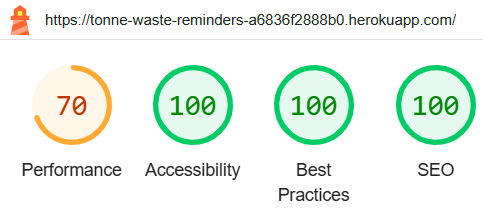
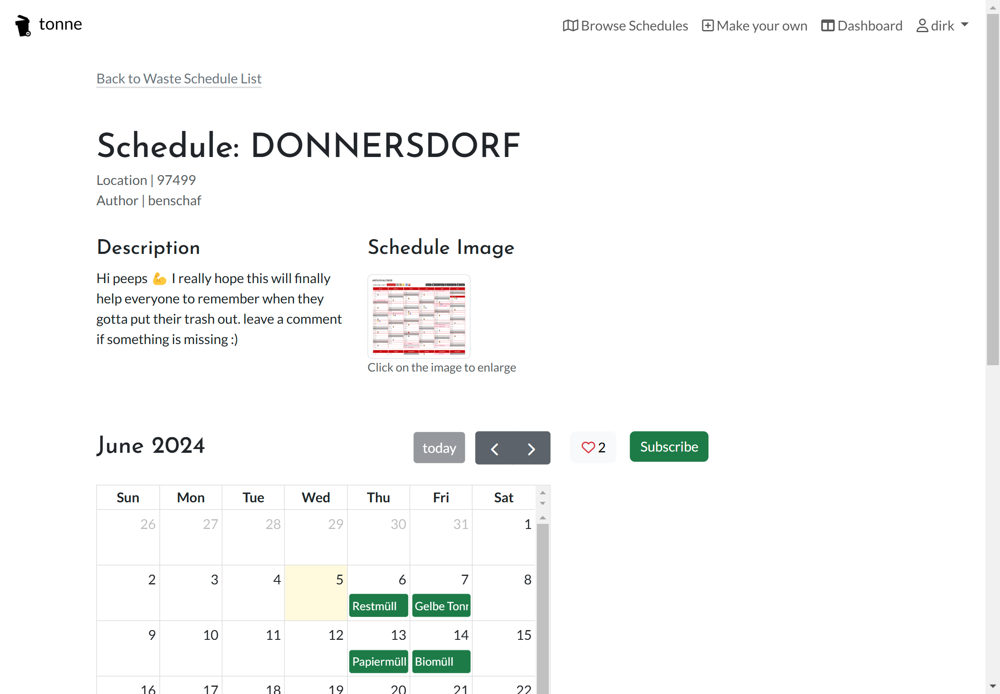

# Testing

> [!NOTE]
> Return back to the [README.md](README.md) file.

## Code Validation

🛑🛑🛑🛑🛑🛑🛑🛑🛑🛑-START OF NOTES (to be deleted)

Use the space to discuss code validation for any of your own code files (where applicable).
You are not required to validate external libraries/frameworks, such as imported Bootstrap, Materialize, Font Awesome, etc.

**IMPORTANT**: You must provide a screenshot for each file you validate.

**PRO TIP**: Always validate the live site pages, not your local code. There could be subtle/hidden differences.

🛑🛑🛑🛑🛑🛑🛑🛑🛑🛑-END OF NOTES (to be deleted)

### HTML

I have used the recommended [HTML W3C Validator](https://validator.w3.org) to validate all of my HTML files.

| Directory | File | Screenshot | Notes |
| --- | --- | --- | --- |
| core | about.html |  | |
| core | index.html |  | |
| schedulebuilder | calendar.html |  | |
| schedulebuilder | location_form.html |  | |
| schedulebuilder | schedule_confirm_delete.html |  | |
| schedulebuilder | schedule_form.html |  | |
| schedulebuilder | update_schedule_form.html |  | |
| templates | 404.html |  | |
| templates | only_schedule.html |  | |
| wasteschedules | dashboard.html |  | |
| wasteschedules | schedule_detail.html |  | |
| wasteschedules | schedule_list.html |  | |

### CSS

I have used the recommended [CSS Jigsaw Validator](https://jigsaw.w3.org/css-validator) to validate all of my CSS files.

| Directory | File | Screenshot | Notes |
| --- | --- | --- | --- |
| static | style.css |  | |

### JavaScript

I have used the recommended [JShint Validator](https://jshint.com) to validate all of my JS files.

| Directory | File | Screenshot | Notes |
| --- | --- | --- | --- |
| static | comments.js |  | |
| static | edit_calendar.js |  | |
| static | index.js |  | |
| static | only_schedule.js |  | |
| static | script.js |  | |

### Python

I have used the recommended [PEP8 CI Python Linter](https://pep8ci.herokuapp.com) to validate all of my Python files.

| Directory | File | CI URL | Screenshot | Notes |
| --- | --- | --- | --- | --- |
|  | copy-credits.py | [PEP8 CI](https://pep8ci.herokuapp.com/https://raw.githubusercontent.com/benschaf/waste-schedule/main/copy-credits.py) |  | |
| core | admin.py | [PEP8 CI](https://pep8ci.herokuapp.com/https://raw.githubusercontent.com/benschaf/waste-schedule/main/core/admin.py) |  | |
| core | models.py | [PEP8 CI](https://pep8ci.herokuapp.com/https://raw.githubusercontent.com/benschaf/waste-schedule/main/core/models.py) |  | |
| core | urls.py | [PEP8 CI](https://pep8ci.herokuapp.com/https://raw.githubusercontent.com/benschaf/waste-schedule/main/core/urls.py) |  | |
| core | views.py | [PEP8 CI](https://pep8ci.herokuapp.com/https://raw.githubusercontent.com/benschaf/waste-schedule/main/core/views.py) |  | |
|  | manage.py | [PEP8 CI](https://pep8ci.herokuapp.com/https://raw.githubusercontent.com/benschaf/waste-schedule/main/manage.py) |  | |
| schedulebuilder | admin.py | [PEP8 CI](https://pep8ci.herokuapp.com/https://raw.githubusercontent.com/benschaf/waste-schedule/main/schedulebuilder/admin.py) |  | |
| schedulebuilder | forms.py | [PEP8 CI](https://pep8ci.herokuapp.com/https://raw.githubusercontent.com/benschaf/waste-schedule/main/schedulebuilder/forms.py) |  | |
| schedulebuilder | models.py | [PEP8 CI](https://pep8ci.herokuapp.com/https://raw.githubusercontent.com/benschaf/waste-schedule/main/schedulebuilder/models.py) |  | |
| schedulebuilder | urls.py | [PEP8 CI](https://pep8ci.herokuapp.com/https://raw.githubusercontent.com/benschaf/waste-schedule/main/schedulebuilder/urls.py) |  | |
| schedulebuilder | views.py | [PEP8 CI](https://pep8ci.herokuapp.com/https://raw.githubusercontent.com/benschaf/waste-schedule/main/schedulebuilder/views.py) |  | |
| tonne | settings.py | [PEP8 CI](https://pep8ci.herokuapp.com/https://raw.githubusercontent.com/benschaf/waste-schedule/main/tonne/settings.py) |  | |
| tonne | urls.py | [PEP8 CI](https://pep8ci.herokuapp.com/https://raw.githubusercontent.com/benschaf/waste-schedule/main/tonne/urls.py) |  | |
| wasteschedules | admin.py | [PEP8 CI](https://pep8ci.herokuapp.com/https://raw.githubusercontent.com/benschaf/waste-schedule/main/wasteschedules/admin.py) |  | |
| wasteschedules | forms.py | [PEP8 CI](https://pep8ci.herokuapp.com/https://raw.githubusercontent.com/benschaf/waste-schedule/main/wasteschedules/forms.py) |  | |
| wasteschedules | models.py | [PEP8 CI](https://pep8ci.herokuapp.com/https://raw.githubusercontent.com/benschaf/waste-schedule/main/wasteschedules/models.py) |  | |
| wasteschedules | urls.py | [PEP8 CI](https://pep8ci.herokuapp.com/https://raw.githubusercontent.com/benschaf/waste-schedule/main/wasteschedules/urls.py) |  | |
| wasteschedules | views.py | [PEP8 CI](https://pep8ci.herokuapp.com/https://raw.githubusercontent.com/benschaf/waste-schedule/main/wasteschedules/views.py) |  | |

## Browser Compatibility

🛑🛑🛑🛑🛑🛑🛑🛑🛑🛑-START OF NOTES (to be deleted)

Use this space to discuss testing the live/deployed site on various browsers.

Consider testing AT LEAST 3 different browsers, if available on your system.

You DO NOT need to use all of the browsers below, just pick any 3 (minimum).

Recommended browsers to consider:
- [Chrome](https://www.google.com/chrome)
- [Firefox (Developer Edition)](https://www.mozilla.org/firefox/developer)
- [Edge](https://www.microsoft.com/edge)
- [Safari](https://support.apple.com/downloads/safari)
- [Brave](https://brave.com/download)
- [Opera](https://www.opera.com/download)

**IMPORTANT**: You must provide screenshots of the tested browsers, to "prove" that you've actually tested them.

Please note, there are services out there that can test multiple browser compatibilities at the same time.
Some of these are paid services, but some are free.
If you use these, you must provide a link to the source used for attribution, and multiple screenshots of the results.

Sample browser testing documentation:

🛑🛑🛑🛑🛑🛑🛑🛑🛑🛑-END OF NOTES (to be deleted)

I've tested my deployed project on multiple browsers to check for compatibility issues.

| Browser | Home | About | Contact | etc | Notes |
| --- | --- | --- | --- | --- | --- |
| Chrome |  |  |  |  | Works as expected |
| Firefox |  |  |  |  | Works as expected |
| Edge |  |  |  |  | Works as expected |
| Safari |  |  |  |  | Minor CSS differences |
| Brave |  |  |  |  | Works as expected |
| Opera |  |  |  |  | Minor differences |
| repeat for any other tested browsers | x | x | x | x | x |

## Responsiveness

🛑🛑🛑🛑🛑🛑🛑🛑🛑🛑-START OF NOTES (to be deleted)

Use this space to discuss testing the live/deployed site on various device sizes.

The minimum requirement is for the following 3 tests:
- Mobile
- Tablet
- Desktop

**IMPORTANT**: You must provide screenshots of the tested responsiveness, to "prove" that you've actually tested them.

Using the "amiresponsive" mockup image (or similar) does not suffice the requirements.
Consider using some of the built-in device sizes in the Developer Tools.

If you have tested the project on your actual mobile phone or tablet, consider also including screenshots of these as well.
It showcases a higher level of manual tests, and can be seen as a positive inclusion!

Sample responsiveness testing documentation:

🛑🛑🛑🛑🛑🛑🛑🛑🛑🛑-END OF NOTES (to be deleted)

I've tested my deployed project on multiple devices to check for responsiveness issues.

| Device | Home | About | Contact | etc | Notes |
| --- | --- | --- | --- | --- | --- |
| Mobile (DevTools) |  |  |  |  | Works as expected |
| Tablet (DevTools) |  |  |  |  | Works as expected |
| Desktop |  |  |  |  | Works as expected |
| XL Monitor |  |  |  |  | Scaling starts to have minor issues |
| 4K Monitor |  |  |  |  | Noticeable scaling issues |
| Google Pixel 7 Pro |  |  |  |  | Works as expected |
| iPhone 14 |  |  |  |  | Works as expected |
| repeat for any other tested browsers | x | x | x | x | x |

## Lighthouse Audit

I've tested my deployed project using the Lighthouse Audit tool in the Chrome Developer Tools to mainly check for accessibility and best practices but also to check for performance and SEO.

| Page | Mobile | Desktop | Notes |
| --- | --- | --- | --- |
| Landing |  |  |  Warnings about performance due to hero image and layout shift (acceptable) |
| About |  |  | Minor warnings |
| Schedule List |  |  | Minor warnings |
| Schedule Detail |  |  | Warnings due to schedule image loading, layout shift, and "links aren't crawlable" |
| Dashboard |  |  | Minor warnings |
| Builder Location |  |  | Minor warnings |
| Builder Schedule |  |  | Minor warnings |
| Builder Calendar |  |  | Minor warnings and "links aren't crawlable" |
| Register |  |  | Minor warnings |
| Login |  |  | Minor warnings |

The "links aren't crawlable" warning is due to FullCalendar which puts some anchor tags into the DOM that aren't actually links. These links not being crawlable is not an issue as they are not meant to be followed by search engines and are only used for FullCalendar's internal functionality.

## Defensive Programming

🛑🛑🛑🛑🛑🛑🛑🛑🛑🛑-START OF NOTES (to be deleted)

Forms:
- Users cannot submit an empty form
- Users must enter valid email addresses

MS3 (Flask) | MS4/PP4/PP5 (Django):
- Users cannot brute-force a URL to navigate to a restricted page
- Users cannot perform CRUD functionality while logged-out
- User-A should not be able to manipulate data belonging to User-B, or vice versa
- Non-Authenticated users should not be able to access pages that require authentication
- Standard users should not be able to access pages intended for superusers


🛑🛑🛑🛑🛑🛑🛑🛑🛑🛑-END OF NOTES (to be deleted)

Defensive programming was manually tested with the below user acceptance testing:

| Page | Expectation | Test | Result | Fix | Screenshot |
| --- | --- | --- | --- | --- | --- |
| **Landing** | | | | | |
| | The Postcode field should only accept values made up of 5 digits | Tested the field by entering an empty form, a 6-digit value, a 5-non-digit value, and a 5-digit value | The field only accepted the 5-digit value | Test concluded and passed |  |
| **Schedule List** | | | | | |
| | The Poscrode field should only accept values made up of 5 digits | Tested the field by entering an empty form, a 6-digit value, a 5-non-digit value, and a 5-digit value | The field only accepted the 5-digit value | Test concluded and passed |  |
| | The Like Button should only perform a CRUD operation for a logged-in user | Tested the button while logged out and while logged in | The button only performed the CRUD operation while logged in | Test concluded and passed |  |
| | The Subscribe Button should only perform a CRUD operation for a logged-in user | Tested the button while logged out and while logged in | The button only performed the CRUD operation while logged in | Test concluded and passed |  |
| | **Schedule Detail** | | | | |
| | The Like Button should only perform a CRUD operation for a logged-in user | Tested the button while logged out and while logged in | The button only performed the CRUD operation while logged in | Test concluded and passed |  |
| | The Subscribe Button should only perform a CRUD operation for a logged-in user | Tested the button while logged out and while logged in | The button only performed the CRUD operation while logged in | Test concluded and passed |  |
| | The Edit Schedule and Delete Schedule Buttons should only be available to the user who created the schedule | Tested the buttons while logged in as the creator and as a different user | The buttons were only available to the creator | Test concluded and passed |  |
| | The Edit Schedule URL should not be accessible if brute forced by a user who is not the creator of the Schedule | Attempted to brute force the [URL](https://tonne-waste-reminders-a6836f2888b0.herokuapp.com/schedule-builder/edit-schedule/kleingarnstadt) | The user was redirected to the landing page and the message was displayed: "You are not the owner of this schedule" | Test concluded and passed |  |
| | The Delete Schedule URL should not be accessible if brute forced by a user who is not the creator of the Schedule | Attempted to brute force the [URL](https://tonne-waste-reminders-a6836f2888b0.herokuapp.com/schedule-builder/delete-schedule/kleingarnstadt) | The user was redirected to the landing page and the message was displayed: "You are not the owner of this schedule" | Test concluded and passed |  |
| | The Comment field and button should only be available to a logged-in user | Tested the field and button while logged out and while logged in | The field and button were only available while logged in | Test concluded and passed |  |
| | The Comment URL should not be accessible if brute forced by a user | Attempted to brute force the [URL](https://tonne-waste-reminders-a6836f2888b0.herokuapp.com/wasteschedules/schedule-comment/kleingarnstadt) | The user was redirected to the relevant schedule detail page | Test concluded and passed |  |
| | The Comment field should only accept freeform text | Tested the field by entering an empty form, a form with only spaces, and a form with text | The field only accepted the form with text | Test concluded and passed |  |
| | A valid Comment should only be submitted by a logged-in user | Tested the form by entering a comment while logged out and while logged in | The comment was only submitted while logged in | Test concluded and passed |  |
| | The Edit and Delete Buttons for a Comment should only be available to the user who created the Comment | Tested the buttons while logged in as the creator and as a different user | The buttons were only available to the creator | Test concluded and passed |  |
| | The Edit Comment URL should not be accessible if brute forced by a user who is not the creator of the Comment | Attempted to brute force the [URL](https://tonne-waste-reminders-a6836f2888b0.herokuapp.com/wasteschedules/schedule-comment-update/27/kleingarnstadt) | The user was redirected to the landing page and a message was displayed "please use the edit button to edit your comment." | Test concluded and passed |  |

!!! ADD THE REST OF THE TESTS FOR THE REMAINING PAGES !!!
beofore refer to the question in issue  [#47](https://github.com/benschaf/waste-schedule/issues/47)

## User Story Testing

| User Story | Screenshot |
| --- | --- |
| [#3](https://github.com/benschaf/waste-schedule/issues/3) As a user, I want an intuitive landing page that explains the app’s purpose and features clearly, so that I can quickly understand how to use it. |  |
| [#13](https://github.com/benschaf/waste-schedule/issues/13) As a user I can instantly find relevant information for my area when visiting the website so that I can get right into setting up the reminders I came for |  |
| [#5](https://github.com/benschaf/waste-schedule/issues/5) As a user, I want to be able to browse waste collection schedules for my area without logging in, so that I can explore available options easily. |  |
| [#6](https://github.com/benschaf/waste-schedule/issues/6) As a user, I want to only have to log in, when I want to subscribe to a schedule or make a schedule so that I can explore as much of the site without being distracted by a log in screen. |  |
| [#14](https://github.com/benschaf/waste-schedule/issues/14) As a user I can click on a specific waste collection schedule from the search results and view detailed information about that schedule so that I can confirm that it's helpful for me |  |
| [#15](https://github.com/benschaf/waste-schedule/issues/15) As a user, I can subscribe to waste collection schedules so that I receive timely reminders for upcoming collection events. (notice the download button) |  |
| [#17](https://github.com/benschaf/waste-schedule/issues/17) As a user I can view a dashboard that provides relevant information on my subscribed schedules so that I can stay organized and have an overview of what I subscribed to. |  |
| [#10](https://github.com/benschaf/waste-schedule/issues/10) As a user, I want to upload my community’s waste collection schedule, so that others can benefit from accurate information. |  |
| [#12](https://github.com/benschaf/waste-schedule/issues/12) As a user, I want to verify the accuracy of uploaded schedules by comparing them with official waste calendars or images, so that I can trust the data. |  |
| [#11](https://github.com/benschaf/waste-schedule/issues/11) As a user, I want to rate and provide feedback on uploaded schedules to help the community, so that we collectively improve waste management. |  |
| [#18](https://github.com/benschaf/waste-schedule/issues/18) As a user who commented on a schedule I can edit or delete my comment so that I can refine or retract my feedback. |  |
| [#19](https://github.com/benschaf/waste-schedule/issues/19) As a user I can like or express appreciation for a specific waste collection schedule so that I can acknowledge well-maintained schedules. |  |

## Automated Testing

I have conducted a series of automated tests on my application.

I fully acknowledge and understand that, in a real-world scenario, an extensive set of additional tests would be more comprehensive.

### JavaScript (Jest Testing)

I have used the [Jest](https://jestjs.io) JavaScript testing framework to test the application functionality.

In order to work with Jest, I first had to initialize NPM.

- `npm init`
- Hit `enter` for all options, except for **test command:**, just type `jest`.

Add Jest to a list called **Dev Dependencies** in a dev environment:

- `npm install --save-dev jest`

**IMPORTANT**: Initial configurations

When creating test files, the name of the file needs to be `file-name.test.js` in order for Jest to properly work.

Without the following, Jest won't properly run the tests:

- `npm install -D jest-environment-jsdom`

Due to a change in Jest's default configuration, you'll need to add the following code to the top of the `.test.js` file:

```js
/**
 * @jest-environment jsdom
 */

const { test, expect } = require("@jest/globals");
const { function1, function2, function3, etc. } = require("../script-name");

beforeAll(() => {
    let fs = require("fs");
    let fileContents = fs.readFileSync(
        "/workspace/waste-schedule/schedulebuilder/templates/schedulebuilder/calendar.html", "utf-8");
    document.open();
    document.write(fileContents);
    document.close();
});
```

Remember to adjust the `fs.readFileSync()` to the specific file you'd like you test.
The example above is testing the `calendar.html` file.

Finally, at the bottom of the script file where your primary scripts are written, include the following at the bottom of the file.
Make sure to include the name of all of your functions that are being tested in the `.test.js` file.

```js
if (typeof module !== "undefined") module.exports = {
    function1, function2, function3, etc.
};
```

Now that these steps have been undertaken, further tests can be written, and be expected to fail initially.
Write JS code that can get the tests to pass as part of the Red-Green refactor process.

Once ready, to run the tests, use this command:

- `npm test`

**NOTE**: To obtain a coverage report, use the following command:

- `npm test --coverage`

Below are the results from the tests that I've written for this application:

| Test Suites | Tests | Screenshot |
| --- | --- | --- |
| 1 passed | 16 passed |  |
| x | x | repeat for all remaining tests |

#### Jest Test Issues

🛑🛑🛑🛑🛑🛑🛑🛑🛑🛑-START OF NOTES (to be deleted)

Use this section to list any known issues you ran into while writing your Jest tests.
Remember to include screenshots (where possible), and a solution to the issue (if known).

This can be used for both "fixed" and "unresolved" issues.

🛑🛑🛑🛑🛑🛑🛑🛑🛑🛑-END OF NOTES (to be deleted)

### Python (Unit Testing)

🛑🛑🛑🛑🛑🛑🛑🛑🛑🛑-START OF NOTES (to be deleted)

Adjust the code below (file names, etc.) to match your own project files/folders.

🛑🛑🛑🛑🛑🛑🛑🛑🛑🛑-END OF NOTES (to be deleted)

I have used Django's built-in unit testing framework to test the application functionality.

In order to run the tests, I ran the following command in the terminal each time:

`python3 manage.py test name-of-app `

To create the coverage report, I would then run the following commands:

`coverage run --source=name-of-app manage.py test`

`coverage report`

To see the HTML version of the reports, and find out whether some pieces of code were missing, I ran the following commands:

`coverage html`

`python3 -m http.server`

Below are the results from the various apps on my application that I've tested:

| App | File | Coverage | Screenshot |
| --- | --- | --- | --- |
| Bag | test_forms.py | 99% |  |
| Bag | test_models.py | 89% |  |
| Bag | test_urls.py | 100% |  |
| Bag | test_views.py | 71% |  |
| Checkout | test_forms.py | 99% |  |
| Checkout | test_models.py | 89% |  |
| Checkout | test_urls.py | 100% |  |
| Checkout | test_views.py | 71% |  |
| Home | test_forms.py | 99% |  |
| Home | test_models.py | 89% |  |
| Home | test_urls.py | 100% |  |
| Home | test_views.py | 71% |  |
| Products | test_forms.py | 99% |  |
| Products | test_models.py | 89% |  |
| Products | test_urls.py | 100% |  |
| Products | test_views.py | 71% |  |
| Profiles | test_forms.py | 99% |  |
| Profiles | test_models.py | 89% |  |
| Profiles | test_urls.py | 100% |  |
| Profiles | test_views.py | 71% |  |
| x | x | x | repeat for all remaining tested apps/files |

#### Unit Test Issues

🛑🛑🛑🛑🛑🛑🛑🛑🛑🛑-START OF NOTES (to be deleted)

Use this section to list any known issues you ran into while writing your unit tests.
Remember to include screenshots (where possible), and a solution to the issue (if known).

This can be used for both "fixed" and "unresolved" issues.

🛑🛑🛑🛑🛑🛑🛑🛑🛑🛑-END OF NOTES (to be deleted)

## Bugs

🛑🛑🛑🛑🛑🛑🛑🛑🛑🛑-START OF NOTES (to be deleted)

This section is primarily used for JavaScript and Python applications,
but feel free to use this section to document any HTML/CSS bugs you might run into.

It's very important to document any bugs you've discovered while developing the project.
Make sure to include any necessary steps you've implemented to fix the bug(s) as well.

**PRO TIP**: screenshots of bugs are extremely helpful, and go a long way!

🛑🛑🛑🛑🛑🛑🛑🛑🛑🛑-END OF NOTES (to be deleted)

- JS Uncaught ReferenceError: `foobar` is undefined/not defined

    

    - To fix this, I _____________________.

- JS `'let'` or `'const'` or `'template literal syntax'` or `'arrow function syntax (=>)'` is available in ES6 (use `'esversion: 11'`) or Mozilla JS extensions (use moz).

    

    - To fix this, I _____________________.

- Python `'ModuleNotFoundError'` when trying to import module from imported package

    

    - To fix this, I _____________________.

- Django `TemplateDoesNotExist` at /appname/path appname/template_name.html

    

    - To fix this, I _____________________.

- Python `E501 line too long` (93 > 79 characters)

    

    - To fix this, I _____________________.

### GitHub **Issues**

🛑🛑🛑🛑🛑🛑🛑🛑🛑🛑-START OF NOTES (to be deleted)

An improved way to manage bugs is to use the built-in **Issues** tracker on your GitHub repository.
To access your Issues, click on the "Issues" tab at the top of your repository.
Alternatively, use this link: https://github.com/benschaf/waste-schedule/issues

If using the Issues tracker for your bug management, you can simplify the documentation process.
Issues allow you to directly paste screenshots into the issue without having to first save the screenshot locally,
then uploading into your project.

You can add labels to your issues (`bug`), assign yourself as the owner, and add comments/updates as you progress with fixing the issue(s).

Once you've sorted the issue, you should then "Close" it.

When showcasing your bug tracking for assessment, you can use the following format:

🛑🛑🛑🛑🛑🛑🛑🛑🛑🛑-END OF NOTES (to be deleted)

**Fixed Bugs**

[](https://github.com/benschaf/waste-schedule/issues?q=is%3Aissue+is%3Aclosed+label%3Abug)

All previously closed/fixed bugs can be tracked [here](https://github.com/benschaf/waste-schedule/issues?q=is%3Aissue+is%3Aclosed).

| Bug | Status |
| --- | --- |
| [JS Uncaught ReferenceError: `foobar` is undefined/not defined](https://github.com/benschaf/waste-schedule/issues/1) | Closed |
| [Python `'ModuleNotFoundError'` when trying to import module from imported package](https://github.com/benschaf/waste-schedule/issues/2) | Closed |
| [Django `TemplateDoesNotExist` at /appname/path appname/template_name.html](https://github.com/benschaf/waste-schedule/issues/3) | Closed |

**Open Issues**

[](https://github.com/benschaf/waste-schedule/issues)
[](https://github.com/benschaf/waste-schedule/issues?q=is%3Aissue+is%3Aclosed)

Any remaining open issues can be tracked [here](https://github.com/benschaf/waste-schedule/issues).

| Bug | Status |
| --- | --- |
| [JS `'let'` or `'const'` or `'template literal syntax'` or `'arrow function syntax (=>)'` is available in ES6 (use `'esversion: 11'`) or Mozilla JS extensions (use moz).](https://github.com/benschaf/waste-schedule/issues/4) | Open |
| [Python `E501 line too long` (93 > 79 characters)](https://github.com/benschaf/waste-schedule/issues/5) | Open |

## Unfixed Bugs

🛑🛑🛑🛑🛑🛑🛑🛑🛑🛑-START OF NOTES (to be deleted)

You will need to mention unfixed bugs and why they were not fixed.
This section should include shortcomings of the frameworks or technologies used.
Although time can be a big variable to consider, paucity of time and difficulty understanding
implementation is not a valid reason to leave bugs unfixed.

If you've identified any unfixed bugs, no matter how small, be sure to list them here.
It's better to be honest and list them, because if it's not documented and an assessor finds the issue,
they need to know whether or not you're aware of them as well, and why you've not corrected/fixed them.

Some examples:

🛑🛑🛑🛑🛑🛑🛑🛑🛑🛑-END OF NOTES (to be deleted)

- On devices smaller than 375px, the page starts to have `overflow-x` scrolling.

    

    - Attempted fix: I tried to add additional media queries to handle this, but things started becoming too small to read.

- For PP3, when using a helper `clear()` function, any text above the height of the terminal does not clear, and remains when you scroll up.

    

    - Attempted fix: I tried to adjust the terminal size, but it only resizes the actual terminal, not the allowable area for text.

- When validating HTML with a semantic `section` element, the validator warns about lacking a header `h2-h6`. This is acceptable.

    

    - Attempted fix: this is a known warning and acceptable, and my section doesn't require a header since it's dynamically added via JS.

🛑🛑🛑🛑🛑🛑🛑🛑🛑🛑-START OF NOTES (to be deleted)

If you legitimately cannot find any unfixed bugs or warnings, then use the following sentence:

🛑🛑🛑🛑🛑🛑🛑🛑🛑🛑-END OF NOTES (to be deleted)

> [!NOTE]
> There are no remaining bugs that I am aware of.
